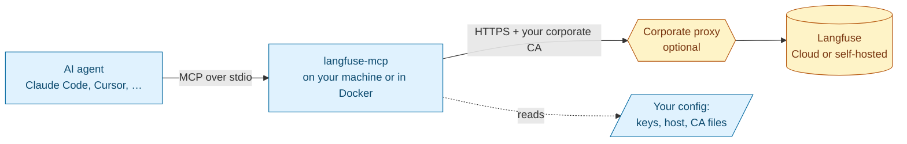

# langfuse-api-mcp

An MCP server that gives AI agents access to the full [Langfuse](https://langfuse.com) public API. It works with **Langfuse Cloud** in any region and with **self-hosted** instances. It is built to run on corporate networks that re-sign TLS traffic with their own certificate authority (CA).

> [!IMPORTANT]
> **Status: pre-alpha. Nothing is installable yet.** This README describes the design that the project is being built to (see [ROADMAP.md](ROADMAP.md)). Sections marked **Planned** describe behavior that does not exist yet. Once the code ships, each marker is removed in the same commit (see [docs rule](.claude/rules/docs-sync.md)).

---

## What it is

A small, stateless program that your AI tool (Claude Code, Claude Desktop, Cursor, VS Code, Codex, …) starts on your machine. It speaks the [Model Context Protocol](https://modelcontextprotocol.io) to the agent and HTTPS to Langfuse. The agent can then:

- investigate traces, observations, sessions, errors, latency and cost;
- read prompts, datasets, experiments, scores, metrics, models, comments and annotation queues;
- make changes, such as promoting a prompt label, creating a score or editing a dataset. This works **only if you turn writes on** (see [Security model](#security-model)).



## When to use it

| Situation | Use this server? |
|---|---|
| Your company network inspects TLS with a custom root CA, and the official Langfuse MCP or CLI fails with `self-signed certificate in certificate chain` / `unable to get local issuer certificate` | **Yes.** This is the main reason the project exists. |
| You want the agent to be **unable** to change Langfuse data unless you explicitly allow it | **Yes.** It is read-only by default, and the server enforces this itself. |
| You run a self-hosted Langfuse behind an internal CA or proxy | **Yes.** |
| You want a single binary with no Node.js or Python runtime on your machine | **Yes.** |
| You only need Langfuse *documentation* in your agent | No. Use the official docs MCP at `https://langfuse.com/api/mcp`. |
| Your agent can run shell commands and your network has no TLS interception | Either works. Langfuse also offers an official CLI and Agent Skill. |

### How it differs from the official Langfuse MCP

| | Official project MCP (`<host>/api/public/mcp`) | This server |
|---|---|---|
| Where it runs | Remote, inside Langfuse | Locally (binary or Docker) |
| Custom CA / corporate proxy | Depends on your MCP client's runtime; no documented options | Explicit settings, plus automatic pickup of CA variables that are already set on your system |
| Writes | Enabled by default; to restrict them you configure a client-side allowlist | **Off by default**. The write tool does not exist until you enable it. |
| API coverage | Curated tool set | Every operation your Langfuse deployment actually answers — older self-hosted versions keep their legacy APIs, newer ones get the new APIs — except trace ingestion and organization admin changes (creating/deleting projects, API keys, users). Detected automatically at startup **(Planned)** |

## How it works

The Langfuse API has about 100 in-scope operations. One tool per operation would fill the agent's context window, so the server exposes a small set of tools **(Planned)**:

| Tool | What it does | Annotations | Available |
|---|---|---|---|
| `search_operations` | Finds the right Langfuse operation for an intent and returns its ID, parameters and docs link | read-only | always |
| `execute_read` | Runs a **read** operation (HTTP GET) by its ID | read-only | always |
| `execute_write` | Runs a **write** operation (POST/PUT/PATCH/DELETE) by its ID. The description says it is intended only for changes the user explicitly requested. Deletes ask for confirmation when your client supports it. | destructive | only when writes are enabled |
| Workflow tools, e.g. trace investigation | Ready-made read flows for the most common tasks (trace tree, errors, latency and cost spikes) | read-only | when the deployment answers the v4 read APIs (Cloud, self-hosted v4); not on self-hosted v3 |

The server keeps nothing between calls (it is stateless). It never takes a URL, host or credential from the agent. It only runs operations from its built-in catalog, against the host you configured.

## Configuration **(Planned)**

Settings come from environment variables, then from an optional [config file](#config-file-non-secret-settings) for non-secret settings. Values set **system-wide** reach the server only if your MCP client passes its environment through; several clients do not (see [Where do environment variables come from?](#where-do-environment-variables-come-from)).

### Connection

| Variable | Required | Default | Meaning |
|---|---|---|---|
| `LANGFUSE_PUBLIC_KEY` | yes | — | Project public key (`pk-lf-…`) |
| `LANGFUSE_SECRET_KEY` | yes | — | Project secret key (`sk-lf-…`). Never logged and never returned to the agent. |
| `LANGFUSE_BASE_URL` | no | `https://cloud.langfuse.com` | Langfuse host. `LANGFUSE_HOST` is accepted as an alias. Must be `https`, except for `localhost`. |

Cloud regions: EU `https://cloud.langfuse.com` · US `https://us.cloud.langfuse.com` · JP `https://jp.cloud.langfuse.com` · HIPAA `https://hipaa.cloud.langfuse.com`. Keys only work in the region where they were created.

### Certificates and proxy

| Variable | Kind | If it can't be loaded | Status |
|---|---|---|---|
| `LANGFUSE_CA_CERT` | PEM file with one or more CA certificates | startup fails with an error naming the variable and the path (missing, unreadable, empty, no PEM certificate, or a damaged certificate) | works: loaded into the trust pool at startup |
| `LANGFUSE_CA_CERTS_PATH` | directory of PEM files; every regular file directly inside it that holds PEM certificates is loaded (subdirectories and non-PEM files are ignored) | startup fails with an error naming the variable and the path (missing directory, unreadable file, a damaged certificate, or no PEM certificate at all) | works: loaded into the trust pool at startup |
| `SSL_CERT_FILE`, `SSL_CERT_DIR`, `NODE_EXTRA_CA_CERTS`, `REQUESTS_CA_BUNDLE`, `CURL_CA_BUNDLE` | picked up automatically if already set | warning in the log, then skipped | **Planned** |
| `LANGFUSE_MCP_IGNORE_AMBIENT_CA` | `true` = do not pick up the variables in the row above | — | **Planned** |
| `HTTPS_PROXY`, `HTTP_PROXY`, `NO_PROXY` | standard proxy variables | — | **Planned** |

"Works" means the server builds its trust pool from these sources when it starts and logs them. The Langfuse client that will use the pool for its connections is still **Planned** (M1).

Trusted roots = **your operating system's certificate store + every CA from the sources above**. Nothing replaces the OS store: Go normally lets `SSL_CERT_FILE`/`SSL_CERT_DIR` *replace* it, so the server reads them as extra CA sources and removes them from its own environment before building the trust pool ([ADR-0006](docs/adr/0006-tls-trust-in-code.md)). If the OS offers no certificates at all (for example a minimal container image without a CA bundle), the server starts from the public roots bundled into the binary instead, then adds your CAs. TLS 1.2 is the minimum version. **There is no option to disable certificate verification.** This is deliberate.

### Behavior

| Variable | Default | Meaning |
|---|---|---|
| `LANGFUSE_MCP_ALLOW_WRITES` | `false` | `true` registers `execute_write`. Leave it off unless you want the agent to change Langfuse data. |
| `LANGFUSE_MCP_TRANSPORT` | `stdio` | `http` starts Streamable HTTP on `127.0.0.1` only, protected by a bearer token |

## Certificate scenarios **(Planned)**

| Your situation | What to do |
|---|---|
| Your IT installed the corporate root CA in the OS store (typical on managed Windows and macOS machines) | Nothing. The OS store is used. |
| You were given a `.pem` / `.crt` file | `LANGFUSE_CA_CERT=/path/to/corp-root.pem` |
| You were given a folder of certificates | `LANGFUSE_CA_CERTS_PATH=/path/to/certs/` |
| `NODE_EXTRA_CA_CERTS` or `REQUESTS_CA_BUNDLE` is already set on your machine for other tools | Nothing. They are picked up automatically. |
| You are behind an HTTP proxy | Set `HTTPS_PROXY` (and `NO_PROXY` for internal hosts) |
| Docker | Mount the file and point the variable at it (see below) |

Get your company's root CA in PEM format:

| OS | How |
|---|---|
| Windows | `certmgr.msc` → Trusted Root Certification Authorities → export as Base-64 X.509 (.CER) |
| macOS | Keychain Access → System Roots / System → select the certificate → File → Export → `.pem` |
| Linux | usually `/usr/local/share/ca-certificates/` or `/etc/pki/ca-trust/source/anchors/` |

## Install and run **(Planned)**

| Channel | Command |
|---|---|
| Release binary (Linux / macOS / Windows, amd64 / arm64) | download from GitHub Releases, then verify the signature (see [Verify what you run](#verify-what-you-run)) |
| Docker | `docker run -i --rm -e LANGFUSE_PUBLIC_KEY -e LANGFUSE_SECRET_KEY -e LANGFUSE_BASE_URL -e LANGFUSE_CA_CERT=/certs/corp.pem -v /path/to/corp.pem:/certs/corp.pem:ro ghcr.io/rodrigorjsf/langfuse-api-mcp` |
| Claude Desktop | `.mcpb` bundle (double-click install) |

### Client configuration

Generic `mcpServers` JSON (Claude Desktop, Cursor and others; the exact file location depends on the client):

```json
{
  "mcpServers": {
    "langfuse": {
      "command": "langfuse-mcp",
      "env": {
        "LANGFUSE_PUBLIC_KEY": "pk-lf-...",
        "LANGFUSE_SECRET_KEY": "sk-lf-...",
        "LANGFUSE_BASE_URL": "https://cloud.langfuse.com",
        "LANGFUSE_CA_CERT": "/path/to/corp-root.pem"
      }
    }
  }
}
```

Claude Code:

```bash
claude mcp add langfuse -- langfuse-mcp   # uses the variables already exported in your shell
```

Per-client snippets (Claude Code, Claude Desktop, Cursor, VS Code, Codex) will be copied from each client's official docs and dated when M1 ships.

### Where do environment variables come from?

The server reads its own process environment, then an optional config file. Whether your *system* variables reach the process depends on the MCP client (facts and sources: [docs/research/mcp-hosts-env.md](docs/research/mcp-hosts-env.md), checked 2026-09-25):

| Client | Passes your system/shell variables? | What to do |
|---|---|---|
| VS Code / GitHub Copilot | yes (full environment) | nothing, or `"env"` / `${env:NAME}` |
| Claude Code | not documented, likely yes | reference them: `"env": {"LANGFUSE_SECRET_KEY": "${LANGFUSE_SECRET_KEY}"}` |
| Cursor, Windsurf | not documented | reference them with `${env:NAME}` in `"env"` |
| Claude Desktop | **no**, only a limited subset | put values in `"env"`, or install the `.mcpb` bundle (keys stored in the OS keychain) |
| Codex CLI | **no**, the environment is cleared | list names in `env_vars = ["LANGFUSE_PUBLIC_KEY", …]` |
| Gemini CLI | yes, but **hides names containing `KEY`/`SECRET`/`TOKEN`** | declare the keys explicitly in `"env"` |
| Docker | only what you pass with `-e` | `-e LANGFUSE_PUBLIC_KEY -e LANGFUSE_SECRET_KEY …` |

### Config file (non-secret settings)

To set the CA, host or proxy once for every client, put them in a config file at your OS's standard config location:

| OS | Path |
|---|---|
| Linux | `~/.config/langfuse-mcp/config.env` (or `$XDG_CONFIG_HOME/langfuse-mcp/config.env`) |
| macOS | `~/Library/Application Support/langfuse-mcp/config.env` |
| Windows | `%AppData%\langfuse-mcp\config.env` |

```ini
# KEY=VALUE per line; environment variables win over this file
LANGFUSE_BASE_URL=https://langfuse.internal.example.com
LANGFUSE_CA_CERT=/etc/ssl/private/corp-root.pem
HTTPS_PROXY=http://proxy.example.com:8080
```

How the file is read:

| Rule | Example |
|---|---|
| One `KEY=VALUE` per line; spaces around the key and the value are trimmed | `LANGFUSE_CA_CERT = /etc/corp/root.pem` |
| A leading `export ` (dotenv style) is ignored | `export LANGFUSE_CA_CERT=/etc/corp/root.pem` |
| Blank lines and lines starting with `#` are ignored | `# corporate CA` |
| Values are taken literally: no quotes, no `${VAR}` expansion | write `C:\corp\root.pem`, not `"C:\corp\root.pem"` |
| A variable set (non-empty) in the environment wins over the file; an empty one does not | `LANGFUSE_CA_CERT=` in the environment still uses the file's value |
| A line without `=`, or with nothing before `=`, stops startup with an error naming the file and the line number | `config file …/config.env line 2: expected KEY=VALUE` |
| No file at that location is fine; the server starts with environment variables only | — |
| Files saved by Windows editors (byte order mark, CRLF line endings) work | — |

CA paths from the file (`LANGFUSE_CA_CERT`, `LANGFUSE_CA_CERTS_PATH`) are explicit CA sources, exactly like the environment variables: if one cannot be loaded, startup fails naming the variable and the path. Today the server acts on the CA settings in the file; host, proxy and behavior settings are accepted in the file but used only once those settings exist **(Planned)**. A misspelled name is currently ignored without a warning (see [#26](https://github.com/rodrigorjsf/langfuse-api-mcp/issues/26)); if a CA from the file seems missing, check the `sources` list in the startup log.

**Keys are not allowed in this file.** If it contains `LANGFUSE_PUBLIC_KEY` or `LANGFUSE_SECRET_KEY`, the server refuses to start and tells you to set the key in the environment or your MCP client's `env` block (the error names the line, never the value), so that no secret sits in a plaintext file ([ADR-0011](docs/adr/0011-non-secret-config-file.md)).

The log at startup lists which CA sources were loaded (paths and counts, never contents). Use it to confirm the setup. It is one JSON line on stderr, for example:

```json
{"time":"…","level":"INFO","msg":"CA sources loaded","roots":"os","sources":[{"variable":"LANGFUSE_CA_CERT","path":"/etc/ssl/private/corp-root.pem","kind":"explicit","origin":"environment","certificates":2}]}
```

`roots` is `os` (your operating system's certificate store) or `bundled-fallback` (the OS offered none). `origin` is where the setting was read: `environment` or `config-file`. `certificates` is how many CA certificates each source added.

## Security model

Designed against the OWASP Top 10 for LLM Applications (2025 and 2026), the OWASP Top 10 for Agentic Applications (2026), the OWASP MCP Top 10 (2025) and the MCP specification's security guidance. The full mapping is in [docs/research/security.md](docs/research/security.md).

| Guarantee | How |
|---|---|
| **Read-only unless you opt in** | Langfuse API keys cannot be made read-only, so the server enforces it. Without `LANGFUSE_MCP_ALLOW_WRITES=true` the write tool is not registered at all. |
| **No data kept** | Stateless. No cache or database, no files written. |
| **Your keys stay with the server** | Read only from the server's environment; a config file holding a key stops startup. Never accepted from the agent, never logged, never included in results. |
| **No arbitrary requests** | The agent picks operations from a fixed catalog. It cannot pass URLs or hosts. Redirects to another host are refused. |
| **No local system access** | No shell commands, no file access beyond reading the CA files you configured and the optional [config file](#config-file-non-secret-settings). |
| **Verified TLS only** | OS store + your CAs, TLS 1.2+, no skip-verify option. |
| **Untrusted data is labelled** | Trace and prompt content returned to the agent is marked as untrusted data and cleaned of hidden Unicode characters. |
| **Bounded** | Timeouts, rate and concurrency limits, response size caps. Langfuse's `Retry-After` is honored. |
| **HTTP mode is local-only** | Binds to `127.0.0.1` with a random bearer token and `Origin`/`Host` checks. |
| **Auditable** | One log line per tool call on stderr (metadata only, no payloads). Open source (Apache-2.0). |

Recommendations: create a dedicated Langfuse key for the agent, set an expiry date on it, and keep writes off unless you need them.

### Verify what you run **(Planned)**

Releases will ship with checksums, an SBOM, cosign keyless signatures and GitHub build provenance (`gh attestation verify`).

## Stack

| Part | Choice | Why |
|---|---|---|
| Language | Go | Single static binary for every OS, small memory footprint, full control of TLS trust ([ADR-0001](docs/adr/0001-go-with-official-go-sdk.md)) |
| MCP SDK | [`modelcontextprotocol/go-sdk`](https://github.com/modelcontextprotocol/go-sdk) (official, Tier 1) | Supports MCP spec 2026-07-28 |
| API source of truth | Langfuse OpenAPI spec ([internal/catalog/spec/langfuse-openapi.json](internal/catalog/spec/langfuse-openapi.json)) | The catalog is generated from it |
| Container | minimal distroless/static image, pinned by digest | No shell, non-root |

## Troubleshooting **(Planned)**

Every failure reaches the agent as a structured error with a stable `code` (e.g. `langfuse_unauthorized`, `langfuse_rate_limited`, `tls_untrusted_certificate`), a `hint` and a `retryable` flag. The server never crashes the connection or returns secrets ([ADR-0008](docs/adr/0008-structured-tool-errors.md)).


| Symptom | Likely cause | Fix |
|---|---|---|
| `x509: certificate signed by unknown authority` | Corporate CA not in the trust pool | Set `LANGFUSE_CA_CERT`, then check the startup log for "CA sources loaded" |
| `401 Unauthorized` | Wrong key pair, or key from another region | Check that `LANGFUSE_BASE_URL` matches the key's region |
| `429 Too Many Requests` | Langfuse Cloud rate limit (per organization) | The server waits for `Retry-After`. Metrics queries have small daily or hourly budgets on some plans. |
| The agent says it cannot change data | Writes are disabled (default) | Set `LANGFUSE_MCP_ALLOW_WRITES=true` if you intend to allow changes |

## For contributors

### Run the checks locally

CI ([`.github/workflows/ci.yml`](.github/workflows/ci.yml)) runs the same five checks on Linux, macOS and Windows for every push and pull request. Run them from the repository root before you push:

| Check | Command | What it proves |
|---|---|---|
| Build | `go build ./...` | everything compiles |
| Vet | `go vet ./...` | no suspicious constructs the compiler accepts |
| Lint | `golangci-lint run` | the rules in [`.golangci.yml`](.golangci.yml): security (`gosec`), closed response bodies, context use, no `InsecureSkipVerify` anywhere, and the package dependency direction of [ADR-0009](docs/adr/0009-domain-oriented-package-layout.md) |
| Tests | `go test -race ./...` | tests pass under the race detector (needs a C compiler, which the race detector requires) |
| Vulnerabilities | `go run golang.org/x/vuln/cmd/govulncheck@v1.8.0 ./...` | no known vulnerability is reachable from the code |

What you need installed:

- **Any Go from 1.21 on.** `go.mod` pins the exact toolchain (`toolchain go1.27.1`). An older local Go downloads that toolchain automatically the first time you run a `go` command in this repository (the default `GOTOOLCHAIN=auto`).
- **golangci-lint v2 built with Go 1.27 or newer.** A binary built with an older Go refuses a `go 1.27` module: it exits with code 3, sometimes without printing anything. Check with `golangci-lint version` ("built with go1.27…"). If yours is older, build it with the module's toolchain:

  ```bash
  GOTOOLCHAIN=go1.27.1 go install github.com/golangci/golangci-lint/v2/cmd/golangci-lint@v2.14.0
  ```

Dependencies stay current through [Dependabot](.github/dependabot.yml) (Go modules and GitHub Actions). Dependabot does not bump the `toolchain` line, so a weekly workflow ([`.github/workflows/go-toolchain.yml`](.github/workflows/go-toolchain.yml)) opens a pull request when a newer Go 1.27.x patch release exists.

### Setup and reading order

Integration-test setup (Langfuse Cloud project + CI secrets): run [`scripts/setup-ci-langfuse-cloud.sh`](scripts/setup-ci-langfuse-cloud.sh).

Start with [CLAUDE.md](CLAUDE.md) (agent and contributor index), [CONTEXT.md](CONTEXT.md) (glossary), [docs/adr/](docs/adr/) (decisions) and [ROADMAP.md](ROADMAP.md).

## References

- Langfuse docs: https://langfuse.com/docs
- API reference: https://api.reference.langfuse.com
- Data regions: https://langfuse.com/security/data-regions
- MCP specification: https://modelcontextprotocol.io
- Go SDK: https://github.com/modelcontextprotocol/go-sdk
- OWASP GenAI Security Project: https://genai.owasp.org
- OWASP MCP Top 10: https://github.com/OWASP/www-project-mcp-top-10
- Node.js enterprise network configuration (why Node-based tools fail on corporate CAs): https://nodejs.org/learn/http/enterprise-network-configuration

## License

[Apache-2.0](LICENSE). Free for commercial use, with an explicit patent grant.
