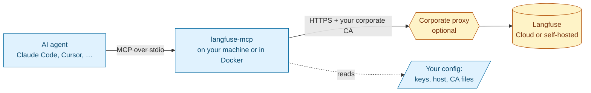

# langfuse-api-mcp

An MCP server that gives AI agents access to the full [Langfuse](https://langfuse.com) public API. It works with **Langfuse Cloud** in any region and with **self-hosted** instances. It is built to run on corporate networks that re-sign TLS traffic with their own certificate authority (CA).

> [!IMPORTANT]
> **Status: pre-alpha. Nothing is installable yet.** This README describes the design that the project is being built to (see [ROADMAP.md](ROADMAP.md)). Sections marked **Planned** describe behavior that does not exist yet. Once the code ships, each marker is removed in the same commit (see [docs rule](.claude/rules/docs-sync.md)).

---

## What it is

A small, stateless program that your AI tool (Claude Code, Claude Desktop, Cursor, VS Code, Codex, …) starts on your machine. It speaks the [Model Context Protocol](https://modelcontextprotocol.io) to the agent and HTTPS to Langfuse. The agent can then:

- investigate traces, observations, sessions, errors, latency and cost;
- read prompts, datasets, experiments, scores, metrics, models, comments and annotation queues;
- make changes, such as promoting a prompt label, creating a score or editing a dataset. This works **only if you turn writes on** (see [Security model](#security-model)).



## When to use it

| Situation | Use this server? |
|---|---|
| Your company network inspects TLS with a custom root CA, and the official Langfuse MCP or CLI fails with `self-signed certificate in certificate chain` / `unable to get local issuer certificate` | **Yes.** This is the main reason the project exists. |
| You want the agent to be **unable** to change Langfuse data unless you explicitly allow it | **Yes.** It is read-only by default, and the server enforces this itself. |
| You run a self-hosted Langfuse behind an internal CA or proxy | **Yes.** |
| You want a single binary with no Node.js or Python runtime on your machine | **Yes.** |
| You only need Langfuse *documentation* in your agent | No. Use the official docs MCP at `https://langfuse.com/api/mcp`. |
| Your agent can run shell commands and your network has no TLS interception | Either works. Langfuse also offers an official CLI and Agent Skill. |

### How it differs from the official Langfuse MCP

| | Official project MCP (`<host>/api/public/mcp`) | This server |
|---|---|---|
| Where it runs | Remote, inside Langfuse | Locally (binary or Docker) |
| Custom CA / corporate proxy | Depends on your MCP client's runtime; no documented options | Explicit settings, plus automatic pickup of CA variables that are already set on your system |
| Writes | Enabled by default; to restrict them you configure a client-side allowlist | **Off by default**. The write tool does not exist until you enable it. |
| API coverage | Curated tool set | Every current, non-deprecated operation of the public API |

## How it works

The Langfuse API has about 100 in-scope operations. One tool per operation would fill the agent's context window, so the server exposes a small set of tools **(Planned)**:

| Tool | What it does | Annotations | Available |
|---|---|---|---|
| `search_operations` | Finds the right Langfuse operation for an intent and returns its ID, parameters and docs link | read-only | always |
| `execute_read` | Runs a **read** operation (HTTP GET) by its ID | read-only | always |
| `execute_write` | Runs a **write** operation (POST/PUT/PATCH/DELETE) by its ID. The description says it is intended only for changes the user explicitly requested. Deletes ask for confirmation when your client supports it. | destructive | only when writes are enabled |
| Workflow tools, e.g. trace investigation | Ready-made read flows for the most common tasks (trace tree, errors, latency and cost spikes) | read-only | always |

The server keeps nothing between calls (it is stateless). It never takes a URL, host or credential from the agent. It only runs operations from its built-in catalog, against the host you configured.

## Configuration **(Planned)**

All settings are environment variables. Values set **system-wide** (shell profile, Windows environment variables, container env) are picked up automatically. You only need to repeat them in your MCP client's JSON `env` block if that client does not pass your environment through (see [Where do environment variables come from?](#where-do-environment-variables-come-from)).

### Connection

| Variable | Required | Default | Meaning |
|---|---|---|---|
| `LANGFUSE_PUBLIC_KEY` | yes | — | Project public key (`pk-lf-…`) |
| `LANGFUSE_SECRET_KEY` | yes | — | Project secret key (`sk-lf-…`). Never logged and never returned to the agent. |
| `LANGFUSE_BASE_URL` | no | `https://cloud.langfuse.com` | Langfuse host. `LANGFUSE_HOST` is accepted as an alias. Must be `https`, except for `localhost`. |

Cloud regions: EU `https://cloud.langfuse.com` · US `https://us.cloud.langfuse.com` · JP `https://jp.cloud.langfuse.com` · HIPAA `https://hipaa.cloud.langfuse.com`. Keys only work in the region where they were created.

### Certificates and proxy

| Variable | Kind | If it can't be loaded |
|---|---|---|
| `LANGFUSE_CA_CERT` | PEM file with one or more CA certificates | startup fails with a clear error |
| `LANGFUSE_CA_CERTS_PATH` | directory of PEM files | startup fails with a clear error |
| `SSL_CERT_FILE`, `SSL_CERT_DIR`, `NODE_EXTRA_CA_CERTS`, `REQUESTS_CA_BUNDLE`, `CURL_CA_BUNDLE` | picked up automatically if already set | warning in the log, then skipped |
| `LANGFUSE_MCP_IGNORE_AMBIENT_CA` | `true` = do not pick up the variables in the row above | — |
| `HTTPS_PROXY`, `HTTP_PROXY`, `NO_PROXY` | standard proxy variables | — |

Trusted roots = **your operating system's certificate store + every CA from the sources above**. Nothing replaces the OS store. **There is no option to disable certificate verification.** This is deliberate.

### Behavior

| Variable | Default | Meaning |
|---|---|---|
| `LANGFUSE_MCP_ALLOW_WRITES` | `false` | `true` registers `execute_write`. Leave it off unless you want the agent to change Langfuse data. |
| `LANGFUSE_MCP_TRANSPORT` | `stdio` | `http` starts Streamable HTTP on `127.0.0.1` only, protected by a bearer token |

## Certificate scenarios **(Planned)**

| Your situation | What to do |
|---|---|
| Your IT installed the corporate root CA in the OS store (typical on managed Windows and macOS machines) | Nothing. The OS store is used. |
| You were given a `.pem` / `.crt` file | `LANGFUSE_CA_CERT=/path/to/corp-root.pem` |
| You were given a folder of certificates | `LANGFUSE_CA_CERTS_PATH=/path/to/certs/` |
| `NODE_EXTRA_CA_CERTS` or `REQUESTS_CA_BUNDLE` is already set on your machine for other tools | Nothing. They are picked up automatically. |
| You are behind an HTTP proxy | Set `HTTPS_PROXY` (and `NO_PROXY` for internal hosts) |
| Docker | Mount the file and point the variable at it (see below) |

Get your company's root CA in PEM format:

| OS | How |
|---|---|
| Windows | `certmgr.msc` → Trusted Root Certification Authorities → export as Base-64 X.509 (.CER) |
| macOS | Keychain Access → System Roots / System → select the certificate → File → Export → `.pem` |
| Linux | usually `/usr/local/share/ca-certificates/` or `/etc/pki/ca-trust/source/anchors/` |

## Install and run **(Planned)**

| Channel | Command |
|---|---|
| Release binary (Linux / macOS / Windows, amd64 / arm64) | download from GitHub Releases, then verify the signature (see [Verify what you run](#verify-what-you-run)) |
| Docker | `docker run -i --rm -e LANGFUSE_PUBLIC_KEY -e LANGFUSE_SECRET_KEY -e LANGFUSE_BASE_URL -e LANGFUSE_CA_CERT=/certs/corp.pem -v /path/to/corp.pem:/certs/corp.pem:ro ghcr.io/rodrigorjsf/langfuse-api-mcp` |
| Claude Desktop | `.mcpb` bundle (double-click install) |

### Client configuration

Generic `mcpServers` JSON (Claude Desktop, Cursor and others; the exact file location depends on the client):

```json
{
  "mcpServers": {
    "langfuse": {
      "command": "langfuse-mcp",
      "env": {
        "LANGFUSE_PUBLIC_KEY": "pk-lf-...",
        "LANGFUSE_SECRET_KEY": "sk-lf-...",
        "LANGFUSE_BASE_URL": "https://cloud.langfuse.com",
        "LANGFUSE_CA_CERT": "/path/to/corp-root.pem"
      }
    }
  }
}
```

Claude Code:

```bash
claude mcp add langfuse -- langfuse-mcp   # uses the variables already exported in your shell
```

Per-client snippets (Claude Code, Claude Desktop, Cursor, VS Code, Codex) will be copied from each client's official docs and dated when M1 ships.

### Where do environment variables come from?

The server reads its own process environment. Whether your *system* variables reach it depends on how your MCP client starts it:

| Launch | Sees your shell or system variables? |
|---|---|
| Client started from a terminal (e.g. Claude Code) | usually yes |
| GUI app on Windows | yes for user and system environment variables |
| GUI app on macOS started from Dock or Finder | often **no** for variables exported in your shell profile. Put them in the client's `env` block. |
| Docker | only what you pass with `-e` |

The log at startup lists which CA sources were loaded (paths and counts, never contents). Use it to confirm the setup.

## Security model

Designed against the OWASP Top 10 for LLM Applications (2025 and 2026), the OWASP Top 10 for Agentic Applications (2026), the OWASP MCP Top 10 (2025) and the MCP specification's security guidance. The full mapping is in [docs/research/security.md](docs/research/security.md).

| Guarantee | How |
|---|---|
| **Read-only unless you opt in** | Langfuse API keys cannot be made read-only, so the server enforces it. Without `LANGFUSE_MCP_ALLOW_WRITES=true` the write tool is not registered at all. |
| **No data kept** | Stateless. No cache or database, no files written. |
| **Your keys stay with the server** | Read only from your configuration. Never accepted from the agent, never logged, never included in results. |
| **No arbitrary requests** | The agent picks operations from a fixed catalog. It cannot pass URLs or hosts. Redirects to another host are refused. |
| **No local system access** | No shell commands, no file access beyond reading the CA files you configured. |
| **Verified TLS only** | OS store + your CAs, TLS 1.2+, no skip-verify option. |
| **Untrusted data is labelled** | Trace and prompt content returned to the agent is marked as untrusted data and cleaned of hidden Unicode characters. |
| **Bounded** | Timeouts, rate and concurrency limits, response size caps. Langfuse's `Retry-After` is honored. |
| **HTTP mode is local-only** | Binds to `127.0.0.1` with a random bearer token and `Origin`/`Host` checks. |
| **Auditable** | One log line per tool call on stderr (metadata only, no payloads). Open source (Apache-2.0). |

Recommendations: create a dedicated Langfuse key for the agent, set an expiry date on it, and keep writes off unless you need them.

### Verify what you run **(Planned)**

Releases will ship with checksums, an SBOM, cosign keyless signatures and GitHub build provenance (`gh attestation verify`).

## Stack

| Part | Choice | Why |
|---|---|---|
| Language | Go | Single static binary for every OS, small memory footprint, full control of TLS trust ([ADR-0001](docs/adr/0001-go-with-official-go-sdk.md)) |
| MCP SDK | [`modelcontextprotocol/go-sdk`](https://github.com/modelcontextprotocol/go-sdk) (official, Tier 1) | Supports MCP spec 2026-07-28 |
| API source of truth | Langfuse OpenAPI spec ([docs/langfuse-openapi.json](docs/langfuse-openapi.json)) | The catalog is generated from it |
| Container | minimal distroless/static image, pinned by digest | No shell, non-root |

## Troubleshooting **(Planned)**

| Symptom | Likely cause | Fix |
|---|---|---|
| `x509: certificate signed by unknown authority` | Corporate CA not in the trust pool | Set `LANGFUSE_CA_CERT`, then check the startup log for "CA sources loaded" |
| `401 Unauthorized` | Wrong key pair, or key from another region | Check that `LANGFUSE_BASE_URL` matches the key's region |
| `429 Too Many Requests` | Langfuse Cloud rate limit (per organization) | The server waits for `Retry-After`. Metrics queries have small daily or hourly budgets on some plans. |
| The agent says it cannot change data | Writes are disabled (default) | Set `LANGFUSE_MCP_ALLOW_WRITES=true` if you intend to allow changes |

## For contributors

Start with [CLAUDE.md](CLAUDE.md) (agent and contributor index), [CONTEXT.md](CONTEXT.md) (glossary), [docs/adr/](docs/adr/) (decisions) and [ROADMAP.md](ROADMAP.md).

## References

- Langfuse docs: https://langfuse.com/docs · API reference: https://api.reference.langfuse.com · Data regions: https://langfuse.com/security/data-regions
- MCP specification: https://modelcontextprotocol.io · Go SDK: https://github.com/modelcontextprotocol/go-sdk
- OWASP GenAI Security Project: https://genai.owasp.org · OWASP MCP Top 10: https://github.com/OWASP/www-project-mcp-top-10
- Node.js enterprise network configuration (why Node-based tools fail on corporate CAs): https://nodejs.org/learn/http/enterprise-network-configuration

## License

[Apache-2.0](LICENSE). Free for commercial use, with an explicit patent grant.
