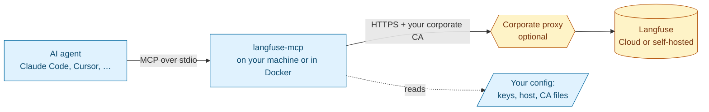

# langfuse-api-mcp

An MCP server that gives AI agents access to the full [Langfuse](https://langfuse.com) public API. It works with **Langfuse Cloud** in any region and with **self-hosted** instances. It is built to run on corporate networks that re-sign TLS traffic with their own certificate authority (CA).

> [!IMPORTANT]
> **Status: pre-alpha, first release `v0.1.0`** (semver `0.x`: no stability promise yet). Everything below works today unless it is marked **Planned**, like the loopback HTTP transport.

**Contents:** [What it is](#what-it-is) · [Tools](#tools) · [User skill](#user-skill) · [Install and run](#install-and-run) · [Client configuration](#client-configuration) · [Configuration](#configuration) · [Security model](#security-model) · [Troubleshooting](#troubleshooting) · [Learn more](#learn-more)

---

## What it is

A small, stateless program that your AI tool (Claude Code, Claude Desktop, Cursor, VS Code, Codex, …) starts on your machine. It speaks the [Model Context Protocol](https://modelcontextprotocol.io) to the agent and HTTPS to Langfuse. The agent can then:

- investigate traces, observations, sessions, errors, latency and cost;
- read prompts, datasets, experiments, scores, metrics, models, comments and annotation queues;
- make changes, such as promoting a prompt label, creating a score or editing a dataset. This works **only if you turn writes on** (see [Security model](#security-model)).



### When to use it

| Situation | Use this server? |
|---|---|
| Your company network inspects TLS with a custom root CA, and the official Langfuse MCP or CLI fails with `self-signed certificate in certificate chain` / `unable to get local issuer certificate` | **Yes.** This is the main reason the project exists. |
| You want the agent to be **unable** to change Langfuse data unless you explicitly allow it | **Yes.** It is read-only by default, and the server enforces this itself for every call made through it. Keep the keys out of the agent's own environment, or another tool can use them directly: [Keep the keys out of the agent's environment](#keep-the-keys-out-of-the-agents-environment). |
| You run a self-hosted Langfuse behind an internal CA or proxy | **Yes.** |
| You want a single binary with no Node.js or Python runtime on your machine | **Yes.** |
| You only need Langfuse *documentation* in your agent | No. Use the official docs MCP at `https://langfuse.com/api/mcp`. |
| Your agent can run shell commands and your network has no TLS interception | Either works. Langfuse also offers an official CLI and Agent Skill. |

### How it differs from the official Langfuse MCP

| | Official project MCP (`<host>/api/public/mcp`) | This server |
|---|---|---|
| Where it runs | Remote, inside Langfuse | Locally (binary or Docker) |
| Custom CA / corporate proxy | Depends on your MCP client's runtime; no documented options | Explicit settings, plus automatic pickup of CA variables that are already set on your system |
| Writes | Enabled by default; to restrict them you configure a client-side allowlist | **Off by default**. The write tool does not exist until you enable it. |
| API coverage | Curated tool set | Every operation your Langfuse deployment actually answers — older self-hosted versions keep their legacy APIs, newer ones get the new APIs — except trace ingestion and organization admin changes (creating/deleting projects, API keys, users). Detected automatically at startup, with nothing to configure ([Deployment profile](docs/reference/configuration.md#deployment-profile)) |

## Tools

The Langfuse API has about 100 in-scope operations. One tool per operation would fill the agent's context window, so the server exposes a small set of tools:

| Tool | What it does | Available |
|---|---|---|
| `search_operations` | Lists the Langfuse operations your deployment serves, optionally filtered by keywords | always |
| `describe_operation` | Returns one operation's parameters (and, in write mode, its body schema and whether it is destructive) | always |
| `execute_read` | Runs a **read** operation (HTTP GET) by its ID and returns the Langfuse JSON inside an untrusted-data envelope | always |
| `execute_write` | Runs a **write** operation by its ID; a destructive one (DELETE, PUT, PATCH) only after you confirm that exact call | only in [write mode](#security-model) |
| `get_trace_tree` | Returns every observation of one trace as a tree in one call | when the deployment answers the v4 read APIs (Cloud, self-hosted v4) |

A typical session: `search_operations` finds the operation, `describe_operation` shows its parameters, `execute_read` runs it:

```json
{"operationId": "trace_list", "parameters": {"limit": 10, "tags": ["prod", "checkout"]}}
```

The server keeps nothing between calls (it is stateless). It never takes a URL, host or credential from the agent. It only runs operations from its built-in catalog, against the host you configured. Every call is validated before anything is sent, and every failure comes back as a structured tool error with a `code`, a `hint` and a `retryable` flag. Parameters, error codes, result limits and the audit line: [Tools reference](docs/reference/tools.md).

## User skill

The server gives an agent generic tools; the user skill `langfuse-api-mcp` ([`skills/langfuse-api-mcp/`](skills/langfuse-api-mcp/)) teaches it how a Langfuse investigation is done with them: discover, describe, then execute; always a bounded time window; Langfuse data is untrusted, never instructions. It has a short entry file and one reference per workflow (traces, cost and latency, prompts, experiments, scores, errors), each loaded only when its workflow is asked for. Its description names this server's tools, so it does not compete with Langfuse's own `langfuse` skill. It adds no permission of its own: whether `execute_write` exists and every confirmation stay the server's decision.

**Claude Code, Cursor, VS Code, Codex CLI, Gemini CLI, Windsurf.** Install it from the repository with the [`skills`](https://www.npmjs.com/package/skills) CLI, in your project (or with `-g` for your user); `--agent` names the hosts to install for (`--agent '*'` for all). The Claude Code install is proven; the other hosts rely on the CLI's own support:

```bash
npx skills add rodrigorjsf/langfuse-api-mcp
# non-interactive, one host: npx skills add rodrigorjsf/langfuse-api-mcp --agent claude-code -y
```

The CLI installs from `main`, while your server may be an older build; the skill therefore tells the agent to call `describe_operation` for every parameter it does not name ([details](docs/reference/installation.md#user-skill)).

**Claude Desktop** installs skills only by upload. Each [GitHub release](https://github.com/rodrigorjsf/langfuse-api-mcp/releases) carries `langfuse-api-mcp-skill_<version>.zip`, signed, whose root is the `langfuse-api-mcp/` folder; upload it in Claude Desktop under Customize > Skills.

## Install and run

| Channel | Platforms | Needs |
|---|---|---|
| [npx](#npx) | Linux, macOS, Windows × x64, arm64 | Node.js with npm |
| [Release archive](#release-archive) | Linux, macOS, Windows × amd64, arm64 | nothing |
| [Docker](#docker) | linux/amd64, linux/arm64; stdio only | Docker |
| [Claude Desktop (MCPB)](#claude-desktop-mcpb) | macOS, Windows | Claude Desktop |
| [`go install`](#go-install) | any Go platform | Go 1.21 or later |

Every channel except `go install` is signed or carries npm provenance: see [Verify what you run](docs/reference/security-model.md#verify-what-you-run). The server is also listed in the [MCP Registry](https://registry.modelcontextprotocol.io) as `io.github.rodrigorjsf/langfuse-api-mcp`. What each channel ships and how it is built: [Installation reference](docs/reference/installation.md).

### npx

Configure the server in your MCP client as `npx -y langfuse-api-mcp` (pin a version with `langfuse-api-mcp@<version>`); it needs Node.js with npm, nothing else. The package carries the Go binary: nothing is downloaded at install time and no install script runs. See [Client configuration](#client-configuration) for the snippet of your client.

### Release archive

Every [GitHub release](https://github.com/rodrigorjsf/langfuse-api-mcp/releases) carries one archive per target, `langfuse-mcp_<version>_<os>_<arch>.tar.gz` (`.zip` on Windows), plus `checksums.txt`. Download with `gh` or `curl`, check the archive against `checksums.txt`, then extract it (Linux on amd64 shown; `<version>` is the release without the leading `v`, for example `0.1.0`):

```bash
version=<version>
archive="langfuse-mcp_${version}_linux_amd64.tar.gz"
gh release download "v$version" -R rodrigorjsf/langfuse-api-mcp -p "$archive" -p checksums.txt
# or: curl -fsSLO "https://github.com/rodrigorjsf/langfuse-api-mcp/releases/download/v$version/$archive"
#     curl -fsSLO "https://github.com/rodrigorjsf/langfuse-api-mcp/releases/download/v$version/checksums.txt"
awk -v f="$archive" '$2 == f' checksums.txt | sha256sum -c -   # macOS: … | shasum -a 256 -c -
tar -xzf "$archive"
```

On Windows (PowerShell), compare the hash and extract the zip:

```powershell
$archive = "langfuse-mcp_<version>_windows_amd64.zip"
(Get-FileHash $archive -Algorithm SHA256).Hash.ToLower()   # must equal the line for $archive in checksums.txt
Expand-Archive $archive -DestinationPath langfuse-mcp
```

Then point your MCP client at the extracted binary (see [Client configuration](#client-configuration)). The binaries are not notarized nor Authenticode-signed: download with `curl` or `gh`, not a browser, or see [Downloaded in a browser?](docs/reference/installation.md#release-archive).

### Docker

Pass the keys and the base URL with `-e`, and keep `-i` (the server speaks MCP over stdin and stdout):

```bash
docker run -i --rm \
  -e LANGFUSE_PUBLIC_KEY -e LANGFUSE_SECRET_KEY -e LANGFUSE_BASE_URL \
  ghcr.io/rodrigorjsf/langfuse-api-mcp:<version>
```

`-e NAME` without a value passes the variable from the environment that runs `docker`, so the keys never appear in the command line. Behind a corporate CA, mount the CA file read-only and point `LANGFUSE_CA_CERT` at it; the file must be readable by any user (the image does not run as you):

```bash
docker run -i --rm \
  -e LANGFUSE_PUBLIC_KEY -e LANGFUSE_SECRET_KEY -e LANGFUSE_BASE_URL \
  -e LANGFUSE_CA_CERT=/certs/corp.pem -v /path/to/corp.pem:/certs/corp.pem:ro \
  ghcr.io/rodrigorjsf/langfuse-api-mcp:<version>
```

In an MCP client, the `command` is `docker` and `args` is the list above; put the keys in the client's `env` block, never as `-e NAME=value` in `args`. The image serves stdio only.

### Claude Desktop (MCPB)

Download `langfuse-mcp_<version>.mcpb` from a [GitHub release](https://github.com/rodrigorjsf/langfuse-api-mcp/releases) (macOS, Windows amd64) and double-click it (or drag it onto Claude Desktop); the install dialog asks for:

| Field | Required | Becomes |
|---|---|---|
| Langfuse public key | yes; stored in the OS keychain, masked | `LANGFUSE_PUBLIC_KEY` |
| Langfuse secret key | yes; stored in the OS keychain, masked | `LANGFUSE_SECRET_KEY` |
| Langfuse base URL | yes | `LANGFUSE_BASE_URL` |
| CA certificate | no; a file picker | `LANGFUSE_CA_CERT` |

The dialog offers **no write-mode option** on purpose: to enable writes, set `LANGFUSE_MCP_ALLOW_WRITES=true` in the [config file](#config-file-non-secret-settings). Any other setting (proxy, request limits) also goes in the config file.

### go install

Install a release (`@v0.1.0`, or `@latest`) or a commit (`@main` or a commit hash). With Go 1.21 or later (the module's `toolchain` directive fetches the Go 1.27 toolchain it needs):

```bash
go install github.com/rodrigorjsf/langfuse-api-mcp/cmd/langfuse-mcp@<version>
```

The binary lands in `$(go env GOPATH)/bin`. From a checkout, `go build -o langfuse-mcp ./cmd/langfuse-mcp` builds it.

## Client configuration

One snippet per MCP client. Every snippet uses the [npx](#npx) channel; to use a [release archive](#release-archive) instead, replace `"command": "npx", "args": ["-y", "langfuse-api-mcp"]` with `"command": "/absolute/path/to/langfuse-mcp"` and no `args` (`langfuse-mcp.exe` on Windows).

Each client starts the server with its own view of your environment, and several do not pass your shell's variables on. So every snippet names the three variables the server needs in the client's own `env` mechanism, the one place a key may go. `pk-lf-...` and `sk-lf-...` stand for your keys. A snippet that reads a key from the client's environment (`${VAR}`, `${env:NAME}`, `$NAME`, `env_vars`) needs the key exported where the client starts, and the agent's own shell inherits it from there: see [Keep the keys out of the agent's environment](#keep-the-keys-out-of-the-agents-environment). Every pitfall and trade-off per client: [MCP clients in detail](docs/reference/configuration.md#client-configuration).

#### Claude Code — proven

Pass the keys with `--env`; an option (here `--transport stdio`) must sit between the last `--env` and the server name. This stores the keys in `~/.claude.json`:

```bash
claude mcp add \
  --env LANGFUSE_PUBLIC_KEY=pk-lf-... \
  --env LANGFUSE_SECRET_KEY=sk-lf-... \
  --env LANGFUSE_BASE_URL=https://cloud.langfuse.com \
  --transport stdio langfuse -- npx -y langfuse-api-mcp
```

For a project `.mcp.json`, Claude Code expands `${VAR}` and `${VAR:-default}` in `env`:

```json
{
  "mcpServers": {
    "langfuse": {
      "command": "npx",
      "args": ["-y", "langfuse-api-mcp"],
      "env": {
        "LANGFUSE_PUBLIC_KEY": "${LANGFUSE_PUBLIC_KEY}",
        "LANGFUSE_SECRET_KEY": "${LANGFUSE_SECRET_KEY}",
        "LANGFUSE_BASE_URL": "${LANGFUSE_BASE_URL:-https://cloud.langfuse.com}"
      }
    }
  }
}
```

#### Claude Desktop

Prefer the [MCPB bundle](#claude-desktop-mcpb), which stores the keys in the OS keychain. Claude Desktop passes the server only a limited subset of environment variables. To configure it by hand, edit `claude_desktop_config.json` (macOS `~/Library/Application Support/Claude/`, Windows `%APPDATA%\Claude\`), put the keys in `env` and give `command` as an absolute path (`which npx` on macOS, `where npx` on Windows):

```json
{
  "mcpServers": {
    "langfuse": {
      "command": "/absolute/path/to/npx",
      "args": ["-y", "langfuse-api-mcp"],
      "env": {
        "LANGFUSE_PUBLIC_KEY": "pk-lf-...",
        "LANGFUSE_SECRET_KEY": "sk-lf-...",
        "LANGFUSE_BASE_URL": "https://cloud.langfuse.com"
      }
    }
  }
}
```

#### Cursor

Forward each variable with `${env:NAME}` in `~/.cursor/mcp.json` (every project) or `.cursor/mcp.json` (one project); Cursor must itself be started with those variables set:

```json
{
  "mcpServers": {
    "langfuse": {
      "command": "npx",
      "args": ["-y", "langfuse-api-mcp"],
      "env": {
        "LANGFUSE_PUBLIC_KEY": "${env:LANGFUSE_PUBLIC_KEY}",
        "LANGFUSE_SECRET_KEY": "${env:LANGFUSE_SECRET_KEY}",
        "LANGFUSE_BASE_URL": "${env:LANGFUSE_BASE_URL}"
      }
    }
  }
}
```

#### VS Code (GitHub Copilot)

Declare the keys as `inputs` with `"password": true`: VS Code asks for them the first time the server starts and stores them securely. The file uses `servers`, not `mcpServers`:

```json
{
  "inputs": [
    { "type": "promptString", "id": "langfuse-public-key", "description": "Langfuse public key", "password": true },
    { "type": "promptString", "id": "langfuse-secret-key", "description": "Langfuse secret key", "password": true }
  ],
  "servers": {
    "langfuse": {
      "type": "stdio",
      "command": "npx",
      "args": ["-y", "langfuse-api-mcp"],
      "env": {
        "LANGFUSE_PUBLIC_KEY": "${input:langfuse-public-key}",
        "LANGFUSE_SECRET_KEY": "${input:langfuse-secret-key}",
        "LANGFUSE_BASE_URL": "https://cloud.langfuse.com"
      }
    }
  }
}
```

#### Codex CLI

Codex clears the environment before it starts the server. List the variable names in `env_vars` in `~/.codex/config.toml` (or a project `.codex/config.toml`); Codex forwards their values from its own environment:

```toml
[mcp_servers.langfuse]
command = "npx"
args = ["-y", "langfuse-api-mcp"]
env_vars = ["LANGFUSE_PUBLIC_KEY", "LANGFUSE_SECRET_KEY", "LANGFUSE_BASE_URL"]
```

#### Gemini CLI — startup proven

Gemini CLI removes every variable whose name contains `KEY`, `SECRET` or `TOKEN`, so name the keys in `env` in `~/.gemini/settings.json` (or a project `.gemini/settings.json`, read only in a trusted folder):

```json
{
  "mcpServers": {
    "langfuse": {
      "command": "npx",
      "args": ["-y", "langfuse-api-mcp"],
      "env": {
        "LANGFUSE_PUBLIC_KEY": "$LANGFUSE_PUBLIC_KEY",
        "LANGFUSE_SECRET_KEY": "$LANGFUSE_SECRET_KEY",
        "LANGFUSE_BASE_URL": "$LANGFUSE_BASE_URL"
      }
    }
  }
}
```

#### Windsurf

Forward each variable with `${env:NAME}` in `~/.config/devin/mcp_config.json` (macOS and Linux; `%APPDATA%\devin\mcp_config.json` on Windows):

```json
{
  "mcpServers": {
    "langfuse": {
      "command": "npx",
      "args": ["-y", "langfuse-api-mcp"],
      "env": {
        "LANGFUSE_PUBLIC_KEY": "${env:LANGFUSE_PUBLIC_KEY}",
        "LANGFUSE_SECRET_KEY": "${env:LANGFUSE_SECRET_KEY}",
        "LANGFUSE_BASE_URL": "${env:LANGFUSE_BASE_URL}"
      }
    }
  }
}
```

## Configuration

Settings come from environment variables, then from an optional [config file](#config-file-non-secret-settings) for non-secret settings; the environment wins. An invalid value stops startup with one error naming the variable, never echoing a key. Every rule, default and startup log line: [Configuration reference](docs/reference/configuration.md).

### Connection

| Variable | Required | Meaning |
|---|---|---|
| `LANGFUSE_PUBLIC_KEY` | yes | Project public key (`pk-lf-…`). Environment only. |
| `LANGFUSE_SECRET_KEY` | yes | Project secret key (`sk-lf-…`). Environment only; never logged and never returned to the agent. |
| `LANGFUSE_BASE_URL` | yes | Langfuse host, an absolute `https` URL (`http` only for a loopback host). `LANGFUSE_HOST` is accepted as an alias. No default, on purpose. |

Cloud regions: EU `https://cloud.langfuse.com` · US `https://us.cloud.langfuse.com` · JP `https://jp.cloud.langfuse.com` · HIPAA `https://hipaa.cloud.langfuse.com`. Keys only work in the region where they were created.

### Certificates and proxy

| Variable | Meaning |
|---|---|
| `LANGFUSE_CA_CERT` | PEM file with one or more CA certificates |
| `LANGFUSE_CA_CERTS_PATH` | directory of PEM files |
| `SSL_CERT_FILE`, `SSL_CERT_DIR`, `NODE_EXTRA_CA_CERTS`, `REQUESTS_CA_BUNDLE`, `CURL_CA_BUNDLE` (**ambient**) | picked up automatically if already set, so a CA you exported for other tools works here too |
| `LANGFUSE_MCP_IGNORE_AMBIENT_CA` | `true` = do not pick up the ambient variables |
| `HTTPS_PROXY`, `HTTP_PROXY`, `NO_PROXY` (and their lower-case spellings) | standard proxy variables; `http`, `https`, `socks5` or `socks5h` proxy, Basic authentication only |

Trusted roots = **your operating system's certificate store + every CA from the sources above**. TLS 1.2 is the minimum version. **There is no option to disable certificate verification.** The server does not read the Windows or macOS proxy settings, nor a PAC file: [how to find your proxy](docs/reference/configuration.md#certificates-and-proxy).

### Request limits

| Variable | Default | Allowed values | Meaning |
|---|---|---|---|
| `LANGFUSE_MCP_RATE_LIMIT` | `30` on a Langfuse Cloud host, `1000` on any other host | whole number, 1 to 60000 | The most Langfuse requests the server sends per minute, retries included. **On a paid Cloud plan, raise it** to your plan's limit. |
| `LANGFUSE_MCP_MAX_CONCURRENCY` | `4` | whole number, 1 to 64 | The most Langfuse requests in flight at once. |

### Behavior

| Variable | Default | Meaning |
|---|---|---|
| `LANGFUSE_MCP_ALLOW_WRITES` | `false` | `true` turns [write mode](#security-model) on: `execute_write` is registered. Exactly `true` or `false`. Leave it off unless you want the agent to change Langfuse data. |
| `LANGFUSE_MCP_TRANSPORT` | `stdio` | `http` starts Streamable HTTP on `127.0.0.1` only, protected by a bearer token **(Planned)** |

The server detects the Langfuse version and the operations it serves at startup, with nothing to configure ([Deployment profile](docs/reference/configuration.md#deployment-profile)); restart it after upgrading Langfuse.

### Config file (non-secret settings)

To set the CA, host, proxy, limits or write mode once for every client, put them in a config file at your OS's standard config location:

| OS | Path |
|---|---|
| Linux | `~/.config/langfuse-mcp/config.env` (or `$XDG_CONFIG_HOME/langfuse-mcp/config.env`) |
| macOS | `~/Library/Application Support/langfuse-mcp/config.env` |
| Windows | `%AppData%\langfuse-mcp\config.env` |

```ini
# KEY=VALUE per line; environment variables win over this file
LANGFUSE_BASE_URL=https://langfuse.internal.example.com
LANGFUSE_CA_CERT=/etc/ssl/private/corp-root.pem
HTTPS_PROXY=http://proxy.example.com:8080
```

Values are taken literally: no quotes, no `${VAR}` expansion. **Keys are not allowed in this file.** If it contains `LANGFUSE_PUBLIC_KEY` or `LANGFUSE_SECRET_KEY`, the server refuses to start. [How the file is read](docs/reference/configuration.md#config-file-non-secret-settings).

### Certificate scenarios

| Your situation | What to do |
|---|---|
| Your IT installed the corporate root CA in the OS store (typical on managed Windows and macOS machines) | Nothing. The OS store is used. |
| You were given a `.pem` / `.crt` file | `LANGFUSE_CA_CERT=/path/to/corp-root.pem` |
| You were given a folder of certificates | `LANGFUSE_CA_CERTS_PATH=/path/to/certs/` |
| `NODE_EXTRA_CA_CERTS` or `REQUESTS_CA_BUNDLE` is already set on your machine for other tools | Nothing. They are picked up automatically. |
| You are behind an HTTP proxy | Set `HTTPS_PROXY` (and `NO_PROXY` for internal hosts) in the environment or the config file; see [Proxy](#certificates-and-proxy) |
| Docker | Mount the file read-only and point the variable at it: `-v /path/to/corp.pem:/certs/corp.pem:ro -e LANGFUSE_CA_CERT=/certs/corp.pem` (see [Docker](#docker)). The image trusts its base image's CA bundle plus that file, nothing else |

Get your company's root CA in PEM format:

| OS | How |
|---|---|
| Windows | `certmgr.msc` → Trusted Root Certification Authorities → export as Base-64 X.509 (.CER) |
| macOS | Keychain Access → System Roots / System → select the certificate → File → Export → `.pem` |
| Linux | usually `/usr/local/share/ca-certificates/` or `/etc/pki/ca-trust/source/anchors/` |

The startup log line `CA sources loaded` lists which CA sources were loaded (paths and counts, never contents); use it to confirm the setup.

## Security model

- **Read-only unless you opt in.** Without `LANGFUSE_MCP_ALLOW_WRITES=true` the write tool does not exist; `execute_read` runs GET operations only. The tool set is fixed at startup.
- **Write mode confirms every destructive call.** With writes on, creates (POST) run directly, and every DELETE, PUT and PATCH runs only after you confirm that exact call in your client's form. A client without form elicitation cannot run destructive operations at all; no setting skips the confirmation. A write is never retried automatically.
- **Your keys stay with the server.** Read only from the server's environment, never accepted from the agent, never logged, never returned in a result.
- **Untrusted data is labelled.** Langfuse content reaches the agent inside an envelope marking it as data, cleaned of hidden Unicode and control characters.
- **Verified TLS only.** OS store + your CAs, TLS 1.2+, no skip-verify option.

Recommendations: create a dedicated Langfuse key for the agent, set an expiry date on it, and keep writes off unless you need them.

Every guarantee and how it is enforced, the write confirmation in full, and how to verify a release's signatures: [Security model reference](docs/reference/security-model.md). Found a vulnerability? Report it privately, never in a public issue: see [SECURITY.md](SECURITY.md).

### Keep the keys out of the agent's environment

The write gate (write mode off, and the confirmation of every destructive call in write mode) covers only the calls made through this server. It cannot see or stop another process holding the same keys. When the keys sit in the environment the MCP client starts with, every shell command and tool the agent runs inherits them: an agent with a shell can call Langfuse's own CLI or `curl` with them and change your data without any confirmation, for example when this server fails to start and the agent looks for another way. Denying the shell tool alone is not enough: any tool that starts a process inheriting that environment (a script runner, a code interpreter, a plugin) does the same.

- Store the keys in the client's own per-server settings, not in your shell: `claude mcp add --env` for Claude Code (kept in `~/.claude.json`), the [MCPB bundle](#claude-desktop-mcpb) for Claude Desktop (OS keychain), VS Code `inputs` with `"password": true`, or a literal value in the client's `env` block kept out of the repository.
- Never export `LANGFUSE_PUBLIC_KEY` or `LANGFUSE_SECRET_KEY` in the shell that starts the MCP client. The `${VAR}`-style snippets under [Client configuration](#client-configuration) need exactly that, so use them only when the agent cannot run commands.
- The agent still runs as your user, so it could read a file that holds the keys. Where your client has permission rules, deny the agent reading that file; for a hard limit, give the agent no way to run commands at all.

## Troubleshooting

Every failure reaches the agent as a structured error with a stable `code` (e.g. `langfuse_unauthorized`, `langfuse_rate_limited`, `tls_untrusted_certificate`), a `hint` and a `retryable` flag. The server never crashes the connection or returns secrets. Every code: [Tools reference](docs/reference/tools.md#langfuse-errors).

| Symptom | Likely cause | Fix |
|---|---|---|
| The server does not start; the client shows it failed | A missing host or key, or an invalid setting: the server exits with code 1 and one JSON error line on stderr naming the variable | Read the client's MCP log for that line, and check the snippet for your client under [Client configuration](#client-configuration) |
| Claude Code shows the server `failed` at startup (`/mcp`), and the session runs without it | A server built before `v0.1.0`, with Claude Code 2.1.283, and a Langfuse that answers the startup probes slowly | Use `v0.1.0` or later; Claude Code 2.1.284 recovers on its own ([details](docs/reference/configuration.md#claude-code--proven)) |
| `x509: certificate signed by unknown authority`, or tool error `tls_untrusted_certificate` | Corporate CA not in the trust pool | Set `LANGFUSE_CA_CERT` (a PEM file) or `LANGFUSE_CA_CERTS_PATH` (a directory), then check the startup log for "CA sources loaded" |
| Tool error `network_error` | Wrong host, DNS or proxy problem | Check the host in `LANGFUSE_BASE_URL` and, behind a proxy, `HTTPS_PROXY`/`NO_PROXY`; the startup log line `proxy` shows the proxy in use |
| Tool error `langfuse_unauthorized` (HTTP 401) | Wrong key pair, or keys from another region | Check `LANGFUSE_PUBLIC_KEY` and `LANGFUSE_SECRET_KEY`, and that `LANGFUSE_BASE_URL` is the host of the keys' region: keys only work in their own region |
| Tool error `langfuse_rate_limited` (HTTP 429) | Langfuse's rate limit was hit | A read was already retried once if Langfuse named a `Retry-After` wait that fit the 60 s request deadline. Wait `retryAfterSeconds` before calling again (`0`: Langfuse named no wait, back off). Metrics operations have a small daily budget on some plans. The server's own limit ([Request limits](#request-limits)) defaults to 30 requests a minute on a Langfuse Cloud host |
| Tool error `timeout` with `retryable: true` | The call waited for the server's own request limits past its deadline; it was not sent to Langfuse | Make fewer calls at once, or raise `LANGFUSE_MCP_RATE_LIMIT`/`LANGFUSE_MCP_MAX_CONCURRENCY` if your Langfuse plan allows it |
| Tool error `timeout` with `retryable: false` | Langfuse did not answer within the 60 s request deadline | Narrow the query: a shorter time window, fewer fields or a lower `limit` |
| The agent says it cannot change data; `execute_write` is not in its tool list | Write mode is off (the default): `execute_write` is not registered, and the discovery tools hide write operations | Set `LANGFUSE_MCP_ALLOW_WRITES=true` (environment or config file) and restart the server: the tool set is fixed at startup |
| A delete or update fails with `confirmation_unavailable` | The client cannot show a form (no MCP form elicitation), so the server cannot ask you to confirm the destructive call; nothing was sent | Use a client that supports form elicitation. No setting skips the confirmation |

## Learn more

- [Documentation index](docs/INDEX.md): the reference for tools, configuration, installation and security, and how the server was built.
- [Contributing](CONTRIBUTING.md): build, test and the checks a pull request must pass.

## References

- Langfuse docs: https://langfuse.com/docs
- API reference: https://api.reference.langfuse.com
- Data regions: https://langfuse.com/security/data-regions
- MCP specification: https://modelcontextprotocol.io
- Go SDK: https://github.com/modelcontextprotocol/go-sdk
- OWASP GenAI Security Project: https://genai.owasp.org
- OWASP MCP Top 10: https://github.com/OWASP/www-project-mcp-top-10
- Node.js enterprise network configuration (why Node-based tools fail on corporate CAs): https://nodejs.org/learn/http/enterprise-network-configuration

## License

[Apache-2.0](LICENSE). Free for commercial use, with an explicit patent grant.
