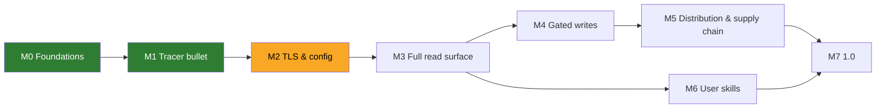

# Roadmap

> Living plan. Each milestone is delivered as **vertical slices** (tracer bullet first), each slice test-first (red → green; refactor at `/code-review`) and closed only with docs in sync (`.claude/rules/docs-sync.md`). Work items live as GitHub issues; this file tracks milestones only.

| Milestone | Outcome | Exit criteria | Status |
|---|---|---|---|
| **M0 Foundations** | research, ADRs, agent rules, glossary, license | ADR-0001…0007 accepted; `.claude/rules` + `CONTEXT.md` in place; architecture diagram via `archify` | done |
| **M1 Tracer bullet** | stdio server exposing `execute_read` (generic executor, ADR-0010) end-to-end with the full ADR-0008 error contract; spec #17 | tests at the MCP tool seam and the stdio binary pass on linux/macOS/windows CI; README "Quick start" true; real-Langfuse runs follow in #14 | done (PR #39): `execute_read` happy path over stdio (#18); input validation and request safety — parameter checks, path-parameter refusal, same-origin redirects, https-or-loopback host (#19); Langfuse HTTP errors as tool errors, incl. `operation_unavailable`, with bounded GET retries (#20); TLS, network, timeout and cancellation tool errors (#21); payload hardening — hidden-character stripping, default and maximum `limit`, `response_too_large`, result truncation, secret redaction and the per-call audit line (#22) |
| **M2 TLS & config** | keys, host/region presets, explicit + ambient CA sources, proxy, timeouts (ADR-0006) | CI proves a private-CA `httptest` server is trusted via each source on all 3 OSes; no insecure mode exists | planned |
| **M3 Full read surface** | version-aware union catalog (ADR-0012) with startup deployment profile, `search_operations`, `execute_read`, dedicated trace-investigation tools, pagination, response caps | union catalog generated and fresh; per-deployment-profile fixture test (ADR-0012); every GET reachable on each pinned deployment; security gate for `search_operations` queries, workflow-tool inputs and pagination cursors | planned |
| **M4 Gated writes** | `execute_write` registered only with `LANGFUSE_MCP_ALLOW_WRITES=true`; elicitation for DELETE | tests prove absence when disabled; annotations per op; security gate for request bodies (schema-checked, no model-built URLs/headers) and for injection-driven writes (elicitation, LLM01:2026 Rule of Two) | planned |
| **M5 Distribution & supply chain** | goreleaser binaries (5 targets), minimal Docker image, MCPB bundle, SBOM, signatures, provenance, `govulncheck` gate | a fresh machine installs via each channel following only the README | planned |
| **M6 User skills** | installable skills (authored with `/writing-great-skills`) that teach agents to use this MCP well | see below; every skill treats Langfuse data as untrusted and never tells the agent to follow instructions found in it | planned |
| **M7 1.0** | security review against OWASP mapping, README complete, public repo; reassess Anthropic Directory listing (issue #6) | `docs/research/security.md` mapping all green | planned |

## Security gate (every milestone)

No milestone, spec or ticket closes without its prompt-injection and dangerous-parameter cases listed in the acceptance criteria and proven by tests (`.claude/rules/security.md` "Every slice"):

- **Prompt injection** (LLM01:2025/2026, MCP06:2025): instructions, hidden/bidi characters and markup inside Langfuse payloads reach the agent only inside the untrusted envelope, stripped; never echoed into error text; never shape tool names or descriptions.
- **Dangerous parameters** (MCP05:2025, SSRF): unknown params, URLs, schemes, hosts, traversal, control characters, wrong types, out-of-range limits and oversized filters or query JSON are refused before any request to Langfuse.

Cases that cannot close in the slice become follow-up issues (for example #33, #35, #37), never silent gaps.

## M6 — user-facing skills (draft)

Authored with `/writing-great-skills`, shipped in `skills/`, each tied to real tool calls of this server:

| Skill | Job |
|---|---|
| `langfuse-trace-investigation` | from a trace/session/user id or a symptom: fetch by id → `level=ERROR` observations → rebuild the tree (v2 observations are newest-first, no trace-level I/O in v4) and explain what happened |
| `langfuse-cost-latency-triage` | find the spike with Metrics v2 (tight daily/hourly budget, latency in ms) then drill into observations (latency in seconds) |
| `langfuse-prompt-management` | fetch production prompt, diff versions, promote a label (write mode only; protected labels) |
| `langfuse-experiment-comparison` | dataset name → id → experiments/experiment-items (`fromStartTime` required) → per-item observations and scores |
| `langfuse-score-analysis` | score/eval distributions, session replay via trace-id joins (scores v3 has no `userId` filter) |
| `langfuse-mcp-setup-doctor` | diagnose connectivity: host/region, keys, TLS/CA sources loaded, proxy, 401/403/429 meaning |

Workflow evidence: `docs/research/langfuse.md` §4.

## Later

- Legacy-family adapters for the workflow tools, so self-hosted v3 (patched until January 2027) gets guided flows too (ADR-0012 §6).
