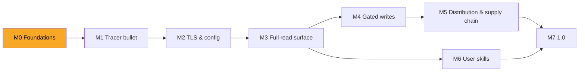

# Roadmap

> Living plan. Each milestone is delivered as **vertical slices** (tracer bullet first), each slice test-first (red → green → refactor) and closed only with docs in sync (`.claude/rules/docs-sync.md`). Work items live as GitHub issues; this file tracks milestones only.

| Milestone | Outcome | Exit criteria | Status |
|---|---|---|---|
| **M0 Foundations** | research, ADRs, agent rules, glossary, license | ADR-0001…0007 accepted; `.claude/rules` + `CONTEXT.md` in place; architecture diagram via `archify` | in progress |
| **M1 Tracer bullet** | `go.mod`, stdio server exposing one read tool (`GET /api/public/health`) end-to-end against `httptest` and a real Langfuse | runs on linux/macOS/windows CI; README "Quick start" true | planned |
| **M2 TLS & config** | keys, host/region presets, explicit + ambient CA sources, proxy, timeouts (ADR-0006) | CI proves a private-CA `httptest` server is trusted via each source on all 3 OSes; no insecure mode exists | planned |
| **M3 Full read surface** | catalog generated from the OpenAPI spec, `search_operations`, `execute_read`, dedicated trace-investigation tools, pagination, response caps | catalog test = spec − ADR-0004 exclusions; every GET reachable | planned |
| **M4 Gated writes** | `execute_write` registered only with `LANGFUSE_MCP_ALLOW_WRITES=true`; elicitation for DELETE | tests prove absence when disabled; annotations per op | planned |
| **M5 Distribution & supply chain** | goreleaser binaries (5 targets), minimal Docker image, MCPB bundle, SBOM, signatures, provenance, `govulncheck` gate | a fresh machine installs via each channel following only the README | planned |
| **M6 User skills** | installable skills (authored with `/writing-great-skills`) that teach agents to use this MCP well | see below | planned |
| **M7 1.0** | security review against OWASP mapping, README complete, public repo | `docs/research/security.md` mapping all green | planned |

## M6 — user-facing skills (draft)

Authored with `/writing-great-skills`, shipped in `skills/`, each tied to real tool calls of this server:

| Skill | Job |
|---|---|
| `langfuse-trace-investigation` | from a trace/session/user id or a symptom: fetch by id → `level=ERROR` observations → rebuild the tree (v2 observations are newest-first, no trace-level I/O in v4) and explain what happened |
| `langfuse-cost-latency-triage` | find the spike with Metrics v2 (tight daily/hourly budget, latency in ms) then drill into observations (latency in seconds) |
| `langfuse-prompt-management` | fetch production prompt, diff versions, promote a label (write mode only; protected labels) |
| `langfuse-experiment-comparison` | dataset name → id → experiments/experiment-items (`fromStartTime` required) → per-item observations and scores |
| `langfuse-score-analysis` | score/eval distributions, session replay via trace-id joins (scores v3 has no `userId` filter) |
| `langfuse-mcp-setup-doctor` | diagnose connectivity: host/region, keys, TLS/CA sources loaded, proxy, 401/403/429 meaning |

Workflow evidence: `docs/research/langfuse.md` §4.
