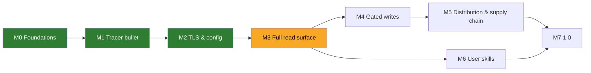

# Roadmap

> Living plan. Each milestone is delivered as **vertical slices** (tracer bullet first), each slice test-first (red → green; refactor at `/code-review`) and closed only with docs in sync (`.claude/rules/docs-sync.md`). Work items live as GitHub issues, each assigned to the GitHub milestone of the same name as its row below; this file tracks milestones only.

| Milestone | Outcome | Exit criteria | Status |
|---|---|---|---|
| **M0 Foundations** | research, ADRs, agent rules, glossary, license | ADR-0001…0007 accepted; `.claude/rules` + `CONTEXT.md` in place; architecture diagram via `archify` | done |
| **M1 Tracer bullet** | stdio server exposing `execute_read` (generic executor, ADR-0010) end-to-end with the full ADR-0008 error contract; spec #17 | tests at the MCP tool seam and the stdio binary pass on linux/macOS/windows CI; README "Quick start" true; real-Langfuse runs: the integration suite (#14, spec #8) runs `execute_read` against self-hosted Langfuse on every PR and against the Cloud test project weekly; its io/metadata window probe (#15) answered #2 — Langfuse REST enforces no 14-day / 50-row limit on Cloud or self-hosted | done (PR #39): `execute_read` happy path over stdio (#18); input validation and request safety — parameter checks, path-parameter refusal, same-origin redirects, https-or-loopback host (#19); Langfuse HTTP errors as tool errors, incl. `operation_unavailable`, with bounded GET retries (#20); TLS, network, timeout and cancellation tool errors (#21); payload hardening — hidden-character stripping, default and maximum `limit`, `response_too_large`, result truncation, secret redaction and the per-call audit line (#22) |
| **M2 TLS & config** | keys, host, explicit + ambient CA sources, config file (ADR-0006, ADR-0011), proxy | CI proves a private-CA `httptest` server is trusted via each source on all 3 OSes; no insecure mode exists; the client honours `HTTPS_PROXY`/`HTTP_PROXY`/`NO_PROXY` from the environment or the config file (both spellings, #45), proven through an in-process fake CONNECT proxy at the client seam and one process test on all 3 OSes; an invalid proxy value stops startup naming the variable, never the value; proxy failures, including a non-200 CONNECT answer, map to `network_error` without echoing the proxy's text (#32). Out of scope: OS proxy settings and PAC (#56), NTLM/Kerberos proxy auth | done (PRs #60, #63): trust pool, CA sources and 3-OS proof (spec #7, #10–#13, #27), config file (#12, #26, #29), required host (#31); **proxy** under spec #58: `config.Secret` redaction for every fmt verb (#46), host-based rate-limit default (#47), proxy from the environment (validated, redacted, logged; #59) and from the config file in both spellings via `x/net/http/httpproxy` (#45, #61), proxy failure classification (#32). Follow-up #62 (Windows mixed-case proxy variables) moved to M7. Dropped 2026-09-26: region presets (Cloud hosts are given by URL) and a configurable request timeout (60 s fixed) |
| **M3 Full read surface** | version-aware union catalog (ADR-0012) with startup deployment profile, `search_operations` + `describe_operation` (ADR-0002 amendment), `execute_read`, one workflow tool `get_trace_tree` (ADR-0002 amendment; triage tools deferred) | union catalog generated, refreshed by a weekly job (ADR-0012 amendment); per-deployment-profile fixture test on every PR; every GET reachable on each pinned deployment in the weekly run; profile resolved within a ~5 s startup budget; small-model discovery eval run and recorded; security gate for `search_operations` queries, workflow-tool inputs and pagination cursors | in progress: operation discovery — `search_operations`, `describe_operation`, discovery hints in `execute_read` (#65, #36); union catalog generated from every release spec since v3.0.0, pure per-profile resolution with the fixture test, weekly regeneration workflow (#71); startup deployment profile detection — health version and family sentinels within ~5 s, resolved catalog, v4-first ranking in `search_operations`, version and family in `operation_unavailable` (#72, #34); legacy operations' index lines say what they do and the operation to prefer, read index measured at ~7 KB (#79), its budget test capped at 8 KiB with a ~1 KB margin (#87); weekly per-deployment check on the four pinned deployments — detected profile and every read of the resolved catalog reachable, 4.46.0 `events_only` also on every PR (#73; the recorded green weekly run is linked from the M3 pull request); `get_trace_tree` — the whole trace tree in one call on v4 deployments, at most 5 pages of 1000, registered only when the v4 read family is on (#74); `execute_read` enforces the numeric and length bounds `describe_operation` reports, on an untyped parameter by the JSON kind of the value (#80, #83); small-model discovery eval script, 11 intents against a fake 4.46.0 `events_only` Langfuse (#75); first recorded run on 2026-09-27 with the local qwen3:8b through Ollama instead of Haiku 4.5 (maintainer's choice: no paid API; the largest model fully on an RTX 3060 12 GB): 7/11 passed, [output](docs/research/raw/2026-09-27-small-model-eval-qwen3-8b.md), one follow-up per failing intent (#97, #98, #99, #100; #88); the union catalog keeps each write operation's JSON request body schema from its own release, cleaned of hidden characters at load, 483 KB under a 1 MiB budget (#81); pull-request CI runs the generator's offline unit tests, PyYAML pinned with the weekly job (#89); index lines drop bold markers and the discovery tools frame them as third-party text (#82); the Observations v2 cursor recorded as a page-size-free keyset and proven live to continue `get_trace_tree` at `execute_read`'s limit, handed back only inside the envelope (#93); a `search_operations` query that matches nothing or asks about traces returns a static trace reads hint naming `get_trace_tree`, `observations_getMany` and `metrics_metrics`, only those the deployment offers (#100); eval intent 11 then reached `metrics_metrics` but qwen3:8b invented its query JSON; `describe_operation metrics_metrics` now gives static query guidance (the validator's own key list, each key's shape, a worked example) and a malformed metrics query's refusal hint lists the keys and names `describe_operation`, and intent 11 passes with qwen3:8b, [output](docs/research/raw/2026-09-27-small-model-eval-intent-11-metrics-guidance.md), by copying the example's fixed dates since the eval gave no current date (#104); the eval now names the run date and the intent-11 matcher checks the query's time window (offline tests `scripts/test_small_model_eval.py`), and the example moved to January 2025: qwen3:8b then computes the right window but sends the query over-escaped or as an object and fails, [output](docs/research/raw/2026-09-27-small-model-eval-intent-11-run-date.md) (#105, follow-up #106); both refusals of a metrics query that is not a JSON string (over-escaped, or an object) and the `describe_operation` guidance now carry one static wording of how the query string is encoded, and intent 11 passes with qwen3:8b with the window computed from the run date, [output](docs/research/raw/2026-09-27-small-model-eval-intent-11-query-encoding.md) (#106); a full rerun at the current code passes 8/11 with qwen3:8b (intent 08 regressed, #114), and a local-model comparison on the same GPU keeps qwen3:8b Q4_K_M with an f16 KV cache as the eval default (qwen3:14b with a q8_0 KV cache 9/11 but fails intent 11; qwen3:8b-q8_0 6/11), [output](docs/research/raw/2026-09-27-small-model-eval-local-model-vram.md) |
| **M4 Gated writes** | `execute_write` registered only with `LANGFUSE_MCP_ALLOW_WRITES=true`; every destructive operation (DELETE, PUT, PATCH) runs only after a confirmation (ADR-0003 amendment) | tests prove `execute_write` absent when write mode is off; `media_getUploadUrl`, `media_patch`, `llmConnections_upsert` and `blobStorageIntegrations_upsertBlobStorageIntegration` excluded (ADR-0004 amendment); a destructive call is refused, never sent, when the client cannot elicit, the user declines, or the re-sent confirmation's signed state does not match its arguments; request bodies checked against the operation's schema, size- and depth-capped, refusals never echo values, no model-built URLs or headers; the write audit line logged at `Warn` with its confirmation outcome; a live write cycle (create, update a label, delete) through `execute_write` against self-hosted Langfuse on every PR; security gate for injection-driven writes (LLM01:2026 Rule of Two). Planned slices: non-destructive POST tracer bullet, body schema check, confirmation. Later: an operation allowlist/denylist in config | in progress (spec #109; slice 1, the POST tracer bullet, #110; slice 2, the body schema check, #111 and #112) |
| **M5 Distribution & supply chain** | goreleaser binaries (5 targets), minimal Docker image, MCPB bundle, SBOM, signatures, provenance, `govulncheck` gate | a fresh machine installs via each channel following only the README | planned |
| **M6 User skills** | installable skills (authored with `/writing-great-skills`) that teach agents to use this MCP well | see below; every skill treats Langfuse data as untrusted and never tells the agent to follow instructions found in it | planned |
| **M7 1.0** | security review against OWASP mapping, README complete, public repo; reassess Anthropic Directory listing (issue #6) | `docs/research/security.md` mapping all green | planned |

## Security gate (every milestone)

No milestone, spec or ticket closes without its prompt-injection and dangerous-parameter cases listed in the acceptance criteria and proven by tests (`.claude/rules/security.md` "Every slice"):

- **Prompt injection** (LLM01:2025/2026, MCP06:2025): instructions, hidden/bidi characters and markup inside Langfuse payloads reach the agent only inside the untrusted envelope, stripped; never echoed into error text; never shape tool names or descriptions.
- **Dangerous parameters** (MCP05:2025, SSRF): unknown params, URLs, schemes, hosts, traversal, control characters, wrong types, out-of-range limits and oversized filters or query JSON are refused before any request to Langfuse.

Cases that cannot close in the slice become follow-up issues (for example #33, #35, #37), never silent gaps.

## M6 — user-facing skills (draft)

Authored with `/writing-great-skills`, shipped in `skills/`, each tied to real tool calls of this server:

| Skill | Job |
|---|---|
| `langfuse-trace-investigation` | from a trace/session/user id or a symptom: fetch by id → `level=ERROR` observations → rebuild the tree (v2 observations are newest-first, no trace-level I/O in v4) and explain what happened |
| `langfuse-cost-latency-triage` | find the spike with Metrics v2 (tight daily/hourly budget, latency in ms) then drill into observations (latency in seconds) |
| `langfuse-prompt-management` | fetch production prompt, diff versions, promote a label (write mode only; protected labels) |
| `langfuse-experiment-comparison` | dataset name → id → experiments/experiment-items (`fromStartTime` required) → per-item observations and scores |
| `langfuse-score-analysis` | score/eval distributions, session replay via trace-id joins (scores v3 has no `userId` filter) |
| `langfuse-mcp-setup-doctor` | diagnose connectivity: host/region, keys, TLS/CA sources loaded, proxy, 401/403/429 meaning |

Workflow evidence: `docs/research/langfuse.md` §4.

## Later

- Triage workflow tools (errors, latency, cost) with the payload-query guard (#42), only if the M3 small-model eval shows agents need them.
- Legacy-family adapters for the workflow tools, so self-hosted v3 (patched until January 2027) gets guided flows too (ADR-0012 §6).
