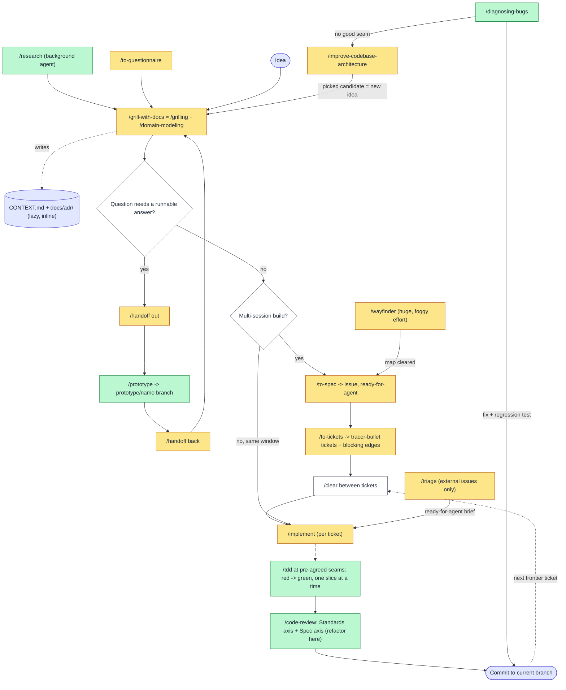

# Engineering process — source material for `.claude/rules/*.md`

**Purpose.** Source material for the `.claude/rules/*.md` files that make this repo (a Go MCP
server for the Langfuse API) follow the engineering process in Matt Pocock's skills from day one.
Every concept below comes from the installed skill files, and each entry cites the file it came
from. The one exception is §6, which is labelled **application, not sourced**.

**Source root.** Every path in this document is relative to
`~/.claude/plugins/cache/claude-plugins-official/mattpocock-skills/1.2.3/skills/`
(plugin version `1.2.3`, read 2026-09-25). Paths are cited without line numbers so the citations
stay valid when the files change.

**Precondition already met.** `/setup-matt-pocock-skills` has already run in this repo. The files
`docs/agents/issue-tracker.md` (GitHub), `docs/agents/triage-labels.md` (default labels) and
`docs/agents/domain.md` exist, the repo `CLAUDE.md` declares single-context, and the `## Agent skills` block is present in
`CLAUDE.md`. Sources: `engineering/setup-matt-pocock-skills/SKILL.md`,
`engineering/ask-matt/SKILL.md` (section "Precondition").

---

## 0. How to read the "Skill" column — invocation matters

A rule can only tell the agent to *invoke* a skill if the agent is able to fire that skill. A
skill whose frontmatter has `disable-model-invocation: true` is **user-invoked**: only the human
typing its name can start it, and no other skill can reach it
(`productivity/writing-for-agents/SKILL-MECHANICS.md`, `engineering/README.md`).

| Invocation | Skills | How a rule must phrase it |
|---|---|---|
| **Agent (model-invoked)** | `tdd`, `codebase-design`, `domain-modeling`, `code-review`, `diagnosing-bugs`, `prototype`, `research`, `grilling`, `resolving-merge-conflicts`, `wizard`, `writing-for-agents` | "Invoke `/tdd`" |
| **User-only** | `to-spec`, `to-tickets`, `implement`, `triage`, `wayfinder`, `grill-with-docs`, `improve-codebase-architecture`, `ask-matt`, `setup-matt-pocock-skills`, `grill-me`, `handoff`, `to-questionnaire`, `wait-what`, `teach` | "Ask the user to run `/to-spec`" |

In the tables below, user-only skills are marked **(U)** and agent-invocable skills are marked
**(A)**.

---

## 1. Status of the concepts named in the brief

Some concepts in the brief do not appear in the skills under the name used, and some appear with
a meaning that differs from the usual one. Rules must follow the skill text.

| Concept in the brief | Status | What the skills actually say | Source |
|---|---|---|---|
| deep module / shallow module | Present, verbatim | Defined in the glossary. | `engineering/codebase-design/SKILL.md` |
| seam | Present, **two meanings** | Feathers' sense ("alter behaviour without editing in that place"), where the word *boundary* is to be avoided. `tdd` calls it "the public boundary you test at". See §2.A. | `engineering/codebase-design/SKILL.md`, `engineering/tdd/SKILL.md` |
| interface vs implementation | Present, verbatim | Interface covers far more than the type signature. | `engineering/codebase-design/SKILL.md` |
| adapter | Present, verbatim | — | `engineering/codebase-design/SKILL.md`, `engineering/codebase-design/DEEPENING.md` |
| tested-through-the-interface | **Not verbatim** | The source phrase is "**The interface is the test surface**". | `engineering/codebase-design/SKILL.md`, `engineering/codebase-design/DEEPENING.md` |
| ubiquitous language | **Barely present** | Appears once as a phrase, never defined: "use the ubiquitous language from `CONTEXT.md`". Everywhere else the skills say "domain glossary vocabulary" or "domain language". | `productivity/wait-what/SKILL.md` |
| CONTEXT.md, ADR | Present | — | `engineering/domain-modeling/*` |
| tracer bullet / vertical slice | Present, **two meanings** | In `tdd`: one test, then one implementation, as opposed to horizontal slicing. In `to-tickets`: a ticket that cuts through every layer and fits one context window. See §2.B and §2.E. | `engineering/tdd/SKILL.md`, `engineering/to-tickets/SKILL.md` |
| red-green-refactor | **Contradicted** | `engineering/README.md` and the `tdd` description say "red-green-refactor". The `tdd` body says: "**Refactoring is not part of the loop.** It belongs to the review stage (see the `code-review` skill)". The rule is therefore red → green, with refactoring done at `/code-review`. | `engineering/tdd/SKILL.md`, `engineering/README.md` |
| grilling | Present | — | `productivity/grilling/SKILL.md` |
| wayfinding map / fog | Present ("fog of war") | — | `engineering/wayfinder/SKILL.md` |
| triage roles | Present | — | `engineering/triage/SKILL.md` |
| AFK agent | **Used, not defined where used** | Used in "ready for an AFK agent". The definition comes from elsewhere: "scoped tightly enough to run with you away from the keyboard, no steering" (PHASE-BOUNDARIES Q4), and the HITL/AFK ticket split in `wayfinder`. | `engineering/setup-matt-pocock-skills/triage-labels.md`, `engineering/triage/AGENT-BRIEF.md`, `engineering/ask-matt/PHASE-BOUNDARIES.md`, `engineering/wayfinder/SKILL.md` |
| spec | Present | — | `engineering/to-spec/SKILL.md` |
| ticket blocking edges | Present | — | `engineering/to-tickets/SKILL.md` |
| prototype-then-discard | **Contradicted** | "Throwaway is a constraint on how the code is written, not a promise to destroy it." The prototype is kept as a **primary source** on a `prototype/<name>` branch, out of main. Only `diagnosing-bugs` Phase 6 says to delete *debug* prototypes (or move them to a clearly marked debug location). | `engineering/ask-matt/SKILL.md`, `engineering/prototype/SKILL.md`, `engineering/diagnosing-bugs/SKILL.md` |
| two-axis code review (Standards / Spec) | Present | — | `engineering/code-review/SKILL.md` |
| diagnosis loop | Present | — | `engineering/diagnosing-bugs/SKILL.md` |

---

## 2. Glossary with rules

Each row gives the term, its definition (quoted or closely paraphrased), the checkable rule for
this repo, the skill that carries the rule out, and the source file. Rules are written as positive
instructions, following the advice in `productivity/writing-for-agents/SKILL.md` (section
"Leading words", on negation) to prompt the positive behaviour and pair any prohibition with its
positive target.

### 2.A Module design vocabulary (`codebase-design`)

The skill requires these exact words: "don't substitute 'component,' 'service,' 'API,' or
'boundary.'" (`engineering/codebase-design/SKILL.md`).

| Term | Definition | Rule for this repo | Skill | Source |
|---|---|---|---|---|
| **Module** | "anything with an interface and an implementation. Deliberately scale-agnostic: a function, class, package, or tier-spanning slice." Avoid: unit, component, service. | Say "module" in design discussion, specs and tickets, whatever the scale. | `codebase-design` (A) | `engineering/codebase-design/SKILL.md` |
| **Interface** | "everything a caller must know to use the module correctly: the type signature, but also invariants, ordering constraints, error modes, required configuration, and performance characteristics." Avoid: API, signature. | When you describe a module's interface, list its invariants, ordering constraints, error modes and required config as well as its types. | `codebase-design` (A) | `engineering/codebase-design/SKILL.md` |
| **Implementation** | "what's inside a module, its body of code." Distinct from Adapter. | Say "adapter" when the seam is the topic and "implementation" otherwise. | `codebase-design` (A) | `engineering/codebase-design/SKILL.md` |
| **Depth** | "leverage at the interface: the amount of behaviour a caller (or test) can exercise per unit of interface they have to learn." | Judge depth by behaviour per unit of interface. The ratio of lines is explicitly rejected as a measure. | `codebase-design` (A) | `engineering/codebase-design/SKILL.md` ("Rejected framings") |
| **Deep module** | "a large amount of behaviour sits behind a small interface". | Aim every new module at a small interface over substantial behaviour. Before merging an interface, ask: can I reduce the methods, simplify the params, hide more inside? | `codebase-design` (A) | `engineering/codebase-design/SKILL.md` |
| **Shallow module** | "the interface is nearly as complex as the implementation" (large interface, thin pass-through implementation). | Collapse a pass-through module into its caller, or deepen it. | `codebase-design` (A); survey via `improve-codebase-architecture` (U) | `engineering/codebase-design/SKILL.md` |
| **Seam** (design sense) | *(Feathers)* "a place where you can alter behaviour without editing in that place; the location at which a module's interface lives." Where the seam goes is its own design decision. Avoid: boundary. | Decide and record seam placement explicitly, separately from what goes behind it. | `codebase-design` (A) | `engineering/codebase-design/SKILL.md` |
| **Internal vs external seam** | A deep module "can have internal seams (private to its implementation, used by its own tests) as well as the external seam at its interface." | Keep internal seams private. Expose only the external seam through the interface. | `codebase-design` (A) | `engineering/codebase-design/SKILL.md`, `engineering/codebase-design/DEEPENING.md` |
| **Adapter** | "a concrete thing that satisfies an interface at a seam. Describes role … not substance." | Name an adapter by the slot it fills (for example the production HTTP adapter and the in-memory test adapter). | `codebase-design` (A) | `engineering/codebase-design/SKILL.md` |
| **Port** | An interface defined at the seam for a remote or external dependency. "The transport is injected as an adapter." | Define a port only for dependencies across a network or process boundary. | `codebase-design` (A) | `engineering/codebase-design/DEEPENING.md` |
| **Leverage** | "what callers get from depth: more capability per unit of interface they learn." | Justify a new interface by the leverage it gives callers. | `codebase-design` (A) | `engineering/codebase-design/SKILL.md` |
| **Locality** | "what maintainers get from depth: change, bugs, knowledge, and verification concentrate in one place". | Put everything that changes together in one module. | `codebase-design` (A) | `engineering/codebase-design/SKILL.md` |
| **The deletion test** | "Imagine deleting the module. If complexity vanishes, it was a pass-through. If complexity reappears across N callers, it was earning its keep." | Apply the deletion test to every wrapper before keeping it. | `codebase-design` (A) | `engineering/codebase-design/SKILL.md`, `engineering/improve-codebase-architecture/SKILL.md` |
| **The interface is the test surface** | "Callers and tests cross the same seam. If you want to test past the interface, the module is probably the wrong shape." | Test through the same interface that callers use. A test that needs internals is a signal to reshape the module. | `codebase-design` (A), `tdd` (A) | `engineering/codebase-design/SKILL.md`, `engineering/codebase-design/DEEPENING.md` |
| **One adapter = hypothetical seam; two = real** | "Don't introduce a port unless at least two adapters are justified (typically production + test). A single-adapter seam is just indirection." | Introduce an interface or port only when two adapters exist or are planned. | `codebase-design` (A) | `engineering/codebase-design/SKILL.md`, `engineering/codebase-design/DEEPENING.md` |
| **Accept dependencies, don't create them** / **Return results, don't produce side effects** / **Small surface area** | The three testability principles. | Inject dependencies through parameters, return values rather than mutating, and keep parameter lists small. | `codebase-design` (A) | `engineering/codebase-design/SKILL.md` |
| **Dependency categories** | 1 In-process (always deepenable, no adapter). 2 Local-substitutable (test with a local stand-in). 3 Remote but owned (Ports & Adapters, in-memory adapter in tests). 4 True external (mock adapter at an injected port). | Classify each dependency into one of the four categories before you choose how to test it. | `codebase-design` (A) | `engineering/codebase-design/DEEPENING.md` |
| **Replace, don't layer** | "Old unit tests on shallow modules become waste once tests at the deepened module's interface exist — delete them." | When you deepen a module, move its tests to the new interface and delete the old shallow tests. | `codebase-design` (A) | `engineering/codebase-design/DEEPENING.md` |
| **Design It Twice** | "your first idea is unlikely to be the best". Spawn 3+ sub-agents, each under a different constraint (minimal, flexible, common-caller, ports & adapters), then compare them on depth, locality and seam placement, and give an opinionated recommendation. | For a hard interface, generate at least 3 radically different designs before you choose one. | `codebase-design` (A) | `engineering/codebase-design/DESIGN-IT-TWICE.md` |
| **Deepening opportunity** | "refactors that turn shallow modules into deep ones. The aim is testability and AI-navigability." Scoped by YAGNI to hot spots in the commit history. | Ask the user to run `/improve-codebase-architecture` on recent hot spots, and treat each pick as an idea that enters the main flow at grilling. | `improve-codebase-architecture` (U) | `engineering/improve-codebase-architecture/SKILL.md`, `engineering/ask-matt/SKILL.md` |

### 2.B Testing vocabulary (`tdd`)

| Term | Definition | Rule for this repo | Skill | Source |
|---|---|---|---|---|
| **Red → green loop** | "TDD is the red → green loop." "**Red before green.** Write the failing test first, then only enough code to pass it." | Write each test and watch it fail before you write the production code. | `tdd` (A) | `engineering/tdd/SKILL.md` |
| **Refactor stage** | "Refactoring is not part of the loop. It belongs to the review stage". | Leave refactoring out of red → green cycles and do it at `/code-review`. | `tdd` (A), `code-review` (A) | `engineering/tdd/SKILL.md` |
| **Seam** (test sense) | "the public boundary you test at: the interface where you observe behavior without reaching inside." | Place every test at a seam, never against internals. | `tdd` (A) | `engineering/tdd/SKILL.md` |
| **Pre-agreed seams** | "Before writing any test, write down the seams under test and confirm them with the user. No test is written at an unconfirmed seam." | Before the first test, list the seams under test and get the user's confirmation. | `tdd` (A) | `engineering/tdd/SKILL.md` |
| **Highest seam / fewest seams** | "Existing seams should be preferred to new ones. Use the highest seam possible … the ideal number is one." | Test a feature at the highest existing seam, and propose a new seam only when none fits. | `to-spec` (U), `tdd` (A) | `engineering/to-spec/SKILL.md` |
| **Vertical slice** (TDD sense) / **tracer bullet** | "one test → one implementation → repeat, each test a tracer bullet that responds to what the last cycle taught you." "One seam, one test, one minimal implementation per cycle." | Work one test at a time, and finish its implementation before writing the next test. | `tdd` (A) | `engineering/tdd/SKILL.md` |
| **Horizontal slicing** (anti-pattern) | "writing all tests first, then all implementation. Bulk tests verify imagined behavior". | Hold unwritten tests until the current slice is green. | `tdd` (A) | `engineering/tdd/SKILL.md` |
| **Implementation-coupled test** (anti-pattern) | "mocks internal collaborators, tests private methods, or verifies through a side channel … The tell: the test breaks when you refactor but behavior hasn't changed." | Assert only on observable outcomes through the interface, and verify through the interface rather than the datastore. | `tdd` (A) | `engineering/tdd/SKILL.md`, `engineering/tdd/tests.md` |
| **Tautological test** (anti-pattern) | "the assertion recomputes the expected value the way the code does … Expected values must come from an independent source of truth — a known-good literal, a worked example, the spec." | Take every expected value from a literal, a worked example or the spec. | `tdd` (A) | `engineering/tdd/SKILL.md`, `engineering/tdd/tests.md` |
| **Good test** | "Tests behavior users/callers care about; Uses public API only; Survives internal refactors; Describes WHAT, not HOW; One logical assertion per test." | Name each test after a capability, and keep one logical assertion per test. | `tdd` (A) | `engineering/tdd/tests.md` |
| **Mock at system boundaries only** | Mock "External APIs, Databases (sometimes — prefer test DB), Time/randomness, File system (sometimes)". Don't mock "your own classes/modules, internal collaborators, anything you control". | Use fakes or mocks only for the external API, time and randomness, and use real code for everything you own. | `tdd` (A) | `engineering/tdd/mocking.md` |
| **SDK-style interface** | "Create specific functions for each external operation instead of one generic function with conditional logic". | Give each external endpoint its own function on the client interface, with no generic `fetch(endpoint)`. | `tdd` (A) | `engineering/tdd/mocking.md` |
| **Domain vocabulary in tests** | "read `CONTEXT.md` (if it exists) so test names and interface vocabulary match the project's domain language, and respect ADRs". | Name tests with terms from `CONTEXT.md`. | `tdd` (A) | `engineering/tdd/SKILL.md` |

### 2.C Domain language (`domain-modeling`)

| Term | Definition | Rule for this repo | Skill | Source |
|---|---|---|---|---|
| **Domain model** (active discipline) | "challenging terms, inventing edge-case scenarios, and writing the glossary and decisions down the moment they crystallise." Reading `CONTEXT.md` alone is not this skill. | When a term or decision changes, invoke `/domain-modeling`. When you only need the vocabulary, just read `CONTEXT.md`. | `domain-modeling` (A) | `engineering/domain-modeling/SKILL.md` |
| **`CONTEXT.md`** (glossary) | "a glossary and nothing else", "totally devoid of implementation details". Each term gets 1–2 sentences, says what it IS, and carries an `_Avoid_:` list. Only project-specific terms belong in it. | Keep `CONTEXT.md` to project-specific domain terms in the `**Term**:` / definition / `_Avoid_:` format. | `domain-modeling` (A) | `engineering/domain-modeling/SKILL.md`, `engineering/domain-modeling/CONTEXT-FORMAT.md` |
| **`_Avoid_` list / be opinionated** | "When multiple words exist for the same concept, pick the best one and list the others under `_Avoid_`." | Use the canonical term in code, issues and tests, never a listed `_Avoid_` synonym. | `domain-modeling` (A) | `engineering/domain-modeling/CONTEXT-FORMAT.md`, `engineering/setup-matt-pocock-skills/domain.md` |
| **Challenge against the glossary** | If the user's term conflicts with `CONTEXT.md`, "call it out immediately". | Flag any conflict with the glossary the moment it appears. | `domain-modeling` (A) | `engineering/domain-modeling/SKILL.md` |
| **Sharpen fuzzy language** | Propose a precise canonical term for any vague or overloaded word. | When one word is doing several jobs, propose one canonical term for each job. | `domain-modeling` (A) | `engineering/domain-modeling/SKILL.md` |
| **Concrete scenarios** | "Invent scenarios that probe edge cases and force the user to be precise about the boundaries between concepts." | Stress-test each new domain relationship with at least one edge-case scenario. | `domain-modeling` (A) | `engineering/domain-modeling/SKILL.md` |
| **Cross-reference with code** | "When the user states how something works, check whether the code agrees." | Check the user's claims against the code and surface any contradiction. | `domain-modeling` (A) | `engineering/domain-modeling/SKILL.md` |
| **Update inline** | "When a term is resolved, update `CONTEXT.md` right there. Don't batch these up". | Write each resolved term into `CONTEXT.md` as soon as it is resolved. | `domain-modeling` (A) | `engineering/domain-modeling/SKILL.md` |
| **Glossary gap** | "If the concept you need isn't in the glossary yet, that's a signal — either you're inventing language the project doesn't use (reconsider) or there's a real gap (note it for `/domain-modeling`)." | When you need a term that is missing from the glossary, either reuse an existing term or record the gap. | `domain-modeling` (A) | `engineering/setup-matt-pocock-skills/domain.md` |
| **ADR** | A record of "*that* a decision was made and *why*". The whole template is a title plus 1–3 sentences. Files are `docs/adr/NNNN-slug.md`, numbered sequentially. | Write ADRs with the minimal template, and add optional sections only when they add value. | `domain-modeling` (A) | `engineering/domain-modeling/ADR-FORMAT.md` |
| **ADR conflict** | "If your output contradicts an existing ADR, surface it explicitly rather than silently overriding". | Quote the ADR number and your reason whenever a change contradicts an ADR. | any | `engineering/setup-matt-pocock-skills/domain.md`, `engineering/improve-codebase-architecture/SKILL.md` |
| **Single vs multi-context** / **`CONTEXT-MAP.md`** | Most repos have one root `CONTEXT.md`. A `CONTEXT-MAP.md` exists only for multi-context repos. | This repo is single-context: one root `CONTEXT.md` plus `docs/adr/`. | — | `engineering/domain-modeling/CONTEXT-FORMAT.md`; repo `CLAUDE.md` (`## Agent skills` → Domain docs) |

### 2.D Grilling (`grilling`, `grill-with-docs`, `grill-me`)

| Term | Definition | Rule for this repo | Skill | Source |
|---|---|---|---|---|
| **Grilling** | "Interview the user relentlessly until you reach a shared understanding." | Settle any plan or design by grilling before you write a spec. | `grilling` (A); `grill-with-docs` (U) | `productivity/grilling/SKILL.md` |
| **Design tree** | "every decision branches into the decisions that hang off it." | Model the open questions as a tree of dependent decisions. | `grilling` (A) | `productivity/grilling/SKILL.md` |
| **Round / frontier** (grilling sense) | "The frontier is every decision whose prerequisites are already settled". "Ask the whole frontier in one round: number each question and give your recommended answer." | Ask every question on the current frontier in one numbered round, each with a recommended answer. Then wait for the answers. | `grilling` (A) | `productivity/grilling/SKILL.md` |
| **Facts vs decisions** | "Finding facts is your job, never the user's … dispatch a sub-agent". "The decisions are the user's". | Look up every fact yourself or with a sub-agent, and put only decisions to the user. | `grilling` (A) | `productivity/grilling/SKILL.md` |
| **Done** (grilling) | "when the frontier is empty … Do not act on it until the user confirms you have reached a shared understanding." | Get explicit confirmation of shared understanding before acting. | `grilling` (A) | `productivity/grilling/SKILL.md` |
| **grill-with-docs vs grill-me** | `grill-with-docs` = `/grilling` + `/domain-modeling`: stateful, and it leaves a paper trail in `CONTEXT.md` and ADRs. `grill-me` is stateless, for work with no repo. | In this repo, grill through `/grill-with-docs` (the user runs it) or through `/grilling` + `/domain-modeling` (the agent). | `grill-with-docs` (U) | `engineering/grill-with-docs/SKILL.md`, `engineering/ask-matt/SKILL.md` |

### 2.E Planning artifacts (`to-spec`, `to-tickets`, `wayfinder`)

| Term | Definition | Rule for this repo | Skill | Source |
|---|---|---|---|---|
| **Spec** | A synthesis of the current conversation ("Do NOT interview the user"), published to the issue tracker with `ready-for-agent`. Sections: Problem Statement, Solution, User Stories (a LONG numbered list), Implementation Decisions, Testing Decisions, Out of Scope, Further Notes. | Ask the user to run `/to-spec` once grilling is done. Specs are GitHub issues in this template. | `to-spec` (U) | `engineering/to-spec/SKILL.md` |
| **No file paths in specs, tickets or briefs** | "Do NOT include specific file paths or code snippets. They may end up being outdated very quickly." The exception is a decision-rich snippet from a prototype, labelled as such. | Describe modules, interfaces and behaviour in specs, tickets and briefs, and cite a prototype snippet only when it encodes a decision. | `to-spec` (U), `to-tickets` (U), `triage` (U) | `engineering/to-spec/SKILL.md`, `engineering/to-tickets/SKILL.md`, `engineering/triage/AGENT-BRIEF.md` |
| **Ticket** | A "tracer-bullet vertical slice", declaring the tickets that block it. Issue template: Parent, What to build, Acceptance criteria, Blocked by. | Ask the user to run `/to-tickets` after the spec is written. | `to-tickets` (U) | `engineering/to-tickets/SKILL.md` |
| **Vertical slice** (ticket sense) | "cuts a narrow but COMPLETE path through every layer (schema, API, UI, tests)". It is "demoable or verifiable on its own" and "sized to fit in a single fresh context window". | Make every ticket an end-to-end behaviour that can be verified alone and fits one fresh session. | `to-tickets` (U) | `engineering/to-tickets/SKILL.md` |
| **Blocking edges** | "the other tickets that must complete before it can start. A ticket with no blockers can start immediately." On a real tracker, use native blocking links. | Use GitHub native issue dependencies for blockers, and publish blockers first. | `to-tickets` (U) | `engineering/to-tickets/SKILL.md`, `engineering/setup-matt-pocock-skills/issue-tracker-github.md` |
| **Frontier** (ticket sense) | "any ticket whose blockers are all done." | Pick the next ticket only from the frontier. | `to-tickets` (U) | `engineering/to-tickets/SKILL.md` |
| **Prefactoring** | "Make the change easy, then make the easy change." "Any prefactoring should be done first". | Schedule prefactor tickets as blockers of the feature tickets. | `to-tickets` (U) | `engineering/to-tickets/SKILL.md` |
| **Wide refactor / blast radius / expand–contract** | A mechanical change whose "blast radius fans across the whole codebase". Sequence it as: expand (new form beside old), then migrate in batches (each batch blocked by expand), then contract (blocked by every batch). | Sequence any codebase-wide rename or retype as expand → migrate batches → contract. | `to-tickets` (U) | `engineering/to-tickets/SKILL.md` |
| **Quiz the user** (ticket breakdown) | Show title, blocked-by and what each ticket delivers, then ask about granularity, edges and merges/splits. "Iterate until the user approves". | Get approval of the breakdown before publishing. | `to-tickets` (U) | `engineering/to-tickets/SKILL.md` |
| **Wayfinder / map** | For work "too big for one agent session, and wrapped in fog". A single issue labelled `wayfinder:map`, which is "an **index**, not a store", with sections Destination, Notes, Decisions so far, Not yet specified, Out of scope. | Ask the user to run `/wayfinder` only for multi-session foggy efforts, never for a well-scoped feature. | `wayfinder` (U) | `engineering/wayfinder/SKILL.md`, `engineering/ask-matt/SKILL.md` |
| **Destination** | What reaching the end of the map looks like. "Naming it is the first act of charting." | Name the destination before creating any ticket. | `wayfinder` (U) | `engineering/wayfinder/SKILL.md` |
| **Decision ticket / "Plan, don't do"** | Tickets are "questions whose resolution is a decision, not slices of a build". "Produce decisions, not deliverables." | Resolve a wayfinder ticket with a decision, and hand the result to `/to-spec`. | `wayfinder` (U) | `engineering/wayfinder/SKILL.md`, `engineering/ask-matt/SKILL.md` |
| **Fog of war / Not yet specified** | "decisions and investigations you can tell are coming but can't yet pin down". Test: "whether you can state the question precisely now — not whether you can answer it now." | Ticket only questions that are already sharp, and keep the rest as fog. | `wayfinder` (U) | `engineering/wayfinder/SKILL.md` |
| **Out of scope** (wayfinder sense) | "Work beyond [the destination] is out of scope — it isn't fog." It never graduates. | Close a mis-scoped ticket and log one line under Out of scope. | `wayfinder` (U) | `engineering/wayfinder/SKILL.md` |
| **Ticket types / HITL vs AFK** | HITL is "human in the loop, worked with a human who speaks for themselves". AFK is "driven by the agent alone". Types: Research (AFK), Prototype (HITL), Grilling (HITL, default), Task (HITL or AFK). | Resolve a HITL ticket only through a live exchange with the human. The agent never answers the human's side. | `wayfinder` (U) | `engineering/wayfinder/SKILL.md` |
| **Claim / one ticket per session** | Assign the ticket before any work. "Never resolve more than one ticket per session", except research tickets. | Assign a wayfinder ticket to yourself as the first write, and resolve one per session. | `wayfinder` (U) | `engineering/wayfinder/SKILL.md` |
| **Refer by name** | Refer to maps and tickets by title, "never by a bare id, number, or slug". | In prose for the human, name issues by title with the link inside. | `wayfinder` (U) | `engineering/wayfinder/SKILL.md` |

### 2.F Triage (`triage`)

| Term | Definition | Rule for this repo | Skill | Source |
|---|---|---|---|---|
| **Triage roles** | 2 category roles (`bug`, `enhancement`) and 5 state roles (`needs-triage`, `needs-info`, `ready-for-agent`, `ready-for-human`, `wontfix`). "Every triaged issue should carry exactly one category role and one state role." | Give every triaged issue exactly one category label and one state label. | `triage` (U) | `engineering/triage/SKILL.md`, `docs/agents/triage-labels.md` (repo) |
| **State transitions** | Unlabelled → `needs-triage` → {`needs-info`, `ready-for-agent`, `ready-for-human`, `wontfix`}. `needs-info` returns to `needs-triage` when the reporter replies. | Flag an unusual transition and ask before applying it. | `triage` (U) | `engineering/triage/SKILL.md` |
| **Triage scope** | "Triage is only for issues you didn't create". Tickets from `/to-tickets` "are already agent-ready, so don't triage them". | Triage only incoming external issues. | `triage` (U) | `engineering/ask-matt/SKILL.md` |
| **AI disclaimer** | Every comment or issue posted during triage "must start with" `> *This was generated by AI during triage.*` | Prefix every triage comment with that disclaimer. | `triage` (U) | `engineering/triage/SKILL.md` |
| **Redundancy / prior-rejection checks** | Search for an existing implementation "by domain concept" and read `.out-of-scope/*.md`. | Run both checks before recommending a triage outcome. | `triage` (U) | `engineering/triage/SKILL.md` |
| **Verify the claim** | "Before any grilling, check that the claim holds up." Reproduce the bug, or run the PR. | Reproduce the reported behaviour before writing a brief. | `triage` (U) | `engineering/triage/SKILL.md` |
| **AFK agent** | An agent working from a `ready-for-agent` issue "away from the keyboard, no steering". | Write every `ready-for-agent` issue so an agent can finish it with no questions. | `triage` (U) | `engineering/triage/AGENT-BRIEF.md`, `engineering/ask-matt/PHASE-BOUNDARIES.md` |
| **Agent brief** | A structured comment that is "the authoritative specification that an AFK agent will work from … the agent brief is the contract". Principles: durability over precision, behavioural not procedural, complete acceptance criteria, explicit scope boundaries. | Every `ready-for-agent` issue carries an Agent Brief with Category, Summary, Current and Desired behaviour, Key interfaces, testable Acceptance criteria and Out of scope. | `triage` (U) | `engineering/triage/AGENT-BRIEF.md` |
| **`.out-of-scope/` knowledge base** | Persistent records of **rejected enhancements**, one file per concept. Never written for "already implemented" wontfix, because that "would poison the dedup checks". | Record a rejected enhancement in `.out-of-scope/<concept>.md`, and answer an already-implemented request by pointing to where the feature lives. | `triage` (U) | `engineering/triage/OUT-OF-SCOPE.md` |
| **needs-info notes** | Template sections: "What we've established so far" and "What we still need from you". Questions must be "specific and actionable". | Post needs-info with the established facts plus concrete questions. | `triage` (U) | `engineering/triage/SKILL.md` |

### 2.G Implementation and review (`implement`, `code-review`, `resolving-merge-conflicts`)

| Term | Definition | Rule for this repo | Skill | Source |
|---|---|---|---|---|
| **Implement** | "Use /tdd where possible, at pre-agreed seams. Run typechecking regularly, single test files regularly, and the full test suite once at the end. Once done, use /code-review … Commit your work to the current branch." | During implementation, run the build/vet and single-package tests often, and the full suite once at the end. Then run `/code-review`, then commit. | `implement` (U) drives `tdd` (A) + `code-review` (A) | `engineering/implement/SKILL.md` |
| **Fixed point** | The commit, branch, tag or merge-base the diff is taken against: `git diff <fixed-point>...HEAD` (three-dot). Confirm it resolves and that the diff is non-empty. | Pin and validate the fixed point before any review. | `code-review` (A) | `engineering/code-review/SKILL.md` |
| **Two-axis review** | **Standards**: does the code conform to the repo's documented standards? **Spec**: does it faithfully implement the originating issue or spec? The axes run as parallel sub-agents and are reported under `## Standards` and `## Spec`, "Do not merge or rerank". | Review every change on both axes separately, and report the worst finding per axis. | `code-review` (A) | `engineering/code-review/SKILL.md` |
| **Spec source order** | Issue refs in commits (`Closes #45`), then a path passed as argument, then a spec file under `docs/`, `specs/` or `.scratch/`, then ask. | Reference the originating issue (`Closes #N`) in commit messages so the Spec axis can find it. | `code-review` (A) | `engineering/code-review/SKILL.md` |
| **Smell baseline** | 12 Fowler smells, always applied: Mysterious Name, Duplicated Code, Feature Envy, Data Clumps, Primitive Obsession, Repeated Switches, Shotgun Surgery, Divergent Change, Speculative Generality, Message Chains, Middle Man, Refused Bequest. "The repo overrides." "Always a judgement call." | Report smells as labelled judgement calls, and let a documented repo standard override them. | `code-review` (A) | `engineering/code-review/SKILL.md` |
| **Scope creep** (Spec axis) | "behaviour in the diff that wasn't asked for". | Deliver exactly what the ticket asks, with nothing extra. | `code-review` (A) | `engineering/code-review/SKILL.md` |
| **Standards source** | "Anything in the repo that documents how code should be written, such as `CODING_STANDARDS.md` or `CONTRIBUTING.md`". | Keep the coding standards in a documented file so the Standards axis has a source. | `code-review` (A) | `engineering/code-review/SKILL.md` |
| **Resolve by intent** | Find each side's primary source (commits, PRs, issues), "Preserve both intents where possible", "Do not invent new behaviour. Always resolve; never `--abort`." Then run typecheck → tests → format. | Resolve each conflict hunk by tracing both intents, then rerun the checks. | `resolving-merge-conflicts` (A) | `engineering/resolving-merge-conflicts/SKILL.md` |

### 2.H Diagnosis (`diagnosing-bugs`)

| Term | Definition | Rule for this repo | Skill | Source |
|---|---|---|---|---|
| **Diagnosis loop** | Phases: 1 build a feedback loop, 2 reproduce and minimise, 3 hypothesise, 4 instrument, 5 fix plus regression test, 6 cleanup and post-mortem. "Skip phases only when explicitly justified." | For any hard bug, invoke `/diagnosing-bugs` and go through the phases in order. | `diagnosing-bugs` (A) | `engineering/diagnosing-bugs/SKILL.md` |
| **Tight, red-capable feedback loop** | "one command … already run at least once" that is red-capable (asserts the user's exact symptom), deterministic, fast and agent-runnable. "No red-capable command, no Phase 2." | Show one command that goes red on the bug before forming any hypothesis. | `diagnosing-bugs` (A) | `engineering/diagnosing-bugs/SKILL.md` |
| **Minimise** | Shrink to "the smallest scenario that still goes red … every remaining element is load-bearing". | Cut the repro one element at a time until every remaining element is needed. | `diagnosing-bugs` (A) | `engineering/diagnosing-bugs/SKILL.md` |
| **Falsifiable ranked hypotheses** | "3–5 ranked hypotheses before testing any of them", each stated as "If <X> is the cause, then <changing Y> will make the bug disappear". Show the list to the user. | Write 3–5 falsifiable hypotheses and show them before probing. | `diagnosing-bugs` (A) | `engineering/diagnosing-bugs/SKILL.md` |
| **Tagged instrumentation** | "Change one variable at a time." Tag debug logs with a unique prefix such as `[DEBUG-a4f2]`, and remove them with a single grep. For performance bugs, measure a baseline first. | Tag every debug log with a unique prefix and grep it out before finishing. | `diagnosing-bugs` (A) | `engineering/diagnosing-bugs/SKILL.md` |
| **Correct seam for the regression test** | A seam where the test "exercises the real bug pattern as it occurs at the call site". "If no correct seam exists, that itself is the finding." | Write the regression test before the fix at a correct seam, or record that no such seam exists. | `diagnosing-bugs` (A) | `engineering/diagnosing-bugs/SKILL.md` |
| **Post-mortem hand-off** | "what would have prevented this bug?" If the answer is architectural, hand off to `/improve-codebase-architecture`, after the fix. | State the confirmed hypothesis in the commit message, and raise any architectural cause after the fix. | `diagnosing-bugs` (A) → `improve-codebase-architecture` (U) | `engineering/diagnosing-bugs/SKILL.md` |
| **Redact** | "Redact every secret first — write `<REDACTED>` in its place. Build loops against env vars". | Keep Langfuse keys in env vars, and write `<REDACTED>` in any shown output. | `diagnosing-bugs` (A) | `engineering/diagnosing-bugs/SKILL.md` |
| **HITL loop** | Last resort: a bash script with `step` and `capture` helpers that drives the human in a structured way. | Use `scripts/hitl-loop.template.sh` only when a human step is unavoidable. | `diagnosing-bugs` (A) | `engineering/diagnosing-bugs/SKILL.md`, `engineering/diagnosing-bugs/scripts/hitl-loop.template.sh` |

### 2.I Prototype, research and human-only steps

| Term | Definition | Rule for this repo | Skill | Source |
|---|---|---|---|---|
| **Prototype** | "throwaway code that answers a question. The question decides the shape." Two branches: logic (a single self-contained HTML file with a pure, liftable module) or UI (N ≤ 5 variants behind `?variant=`). | When a question needs a runnable answer, prototype it before speccing. | `prototype` (A) | `engineering/prototype/SKILL.md`, `engineering/prototype/LOGIC.md`, `engineering/prototype/UI.md` |
| **Throwaway ≠ discard** | "Throwaway is a constraint on how the code is written, not a promise to destroy it". Rules: marked as a prototype, trivial to run, no persistence, no polish or tests, surface the state. | Write prototypes with no tests or polish, clearly named as prototypes. | `prototype` (A) | `engineering/prototype/SKILL.md`, `engineering/ask-matt/SKILL.md` |
| **Capture as primary source** | "Fold any validated decision into the real code, then capture the prototype itself as a primary source: commit it to a throwaway branch, out of main, and leave a context pointer to that branch on the implementation issue." | Commit each finished prototype to `prototype/<name>`, link it from the issue, and keep only the validated decision in main. | `prototype` (A) | `engineering/prototype/SKILL.md` |
| **Portable logic module** | The logic is "a small, pure module that could be lifted out … no DOM". | Keep prototype logic pure so it can be lifted into the real module. | `prototype` (A) | `engineering/prototype/LOGIC.md` |
| **Research** | A background agent that investigates "against primary sources — official docs, source code, specs, first-party APIs" and writes one cited Markdown file. "Research feeds the thinking, it doesn't replace it." | Cite a primary source for every claim in a research file, and store the file under `docs/research/`. | `research` (A) | `engineering/research/SKILL.md`, `engineering/ask-matt/SKILL.md` |
| **Questionnaire** | For a decision that lives in someone else's head. "Grill the send, not the subject." | Ask the user to run `/to-questionnaire` when a blocker needs another person's knowledge. | `to-questionnaire` (U) | `productivity/to-questionnaire/SKILL.md` |
| **Wizard** | A bash script that walks a human through steps "only they can perform" (credentials, CI secrets, dashboards). "If the agent could just do it itself, it should." | Generate a wizard for Langfuse key and CI secret setup instead of re-explaining it each time. | `wizard` (A) | `engineering/wizard/SKILL.md` |

### 2.J Session and context management (`ask-matt`, `handoff`)

| Term | Definition | Rule for this repo | Skill | Source |
|---|---|---|---|---|
| **Flow / main flow / on-ramp** | "A flow is a path through the skills." The main flow runs idea → ship. On-ramps (triage, diagnosing-bugs, wayfinder) merge onto it. | Route work onto the main flow in §3. | `ask-matt` (U) | `engineering/ask-matt/SKILL.md` |
| **Context hygiene** | "Keep steps 1–3 in one unbroken context window — don't compact or clear until after `/to-tickets`". "Each `/implement` then starts fresh". | Keep grill → spec → tickets in one session, and start each ticket's implementation in a fresh one. | `ask-matt` (U) | `engineering/ask-matt/SKILL.md` |
| **Smart zone** | The window "(~150k tokens …) within which the model still reasons sharply". | When nearing ~150k tokens before `/to-tickets`, compact at the nearest phase boundary. | `ask-matt` (U) | `engineering/ask-matt/SKILL.md`, `engineering/ask-matt/PHASE-BOUNDARIES.md` |
| **Phase / phase boundary** | A phase is a chunk of work inside a session. The boundary between phases "is the only place this decision belongs". | Make continue, clear, handoff, subagent or compact decisions only at a phase boundary. | `ask-matt` (U) | `engineering/ask-matt/PHASE-BOUNDARIES.md` |
| **Five options, ordered** | 1 Continue, 2 `/clear`, 3 `/handoff` (new harness, new directory, colleague, or mid-phase fork only), 4 Subagent (if doable AFK), 5 `/compact` ("the default, not the first reach"). | Work through the five questions in order at each boundary, and take the first yes. | `ask-matt` (U) | `engineering/ask-matt/PHASE-BOUNDARIES.md` |
| **Primary vs secondary source** | Every move except Continue "turns a primary source into a secondary source". The trade is less information for less noise and more room. | Prefer Continue when the next phase needs the reasoning verbatim. | `ask-matt` (U) | `engineering/ask-matt/PHASE-BOUNDARIES.md` |
| **Handoff document** | Saved to the OS temp directory, with a "suggested skills" section. It references artifacts rather than duplicating them, and is redacted. | Reference specs, ADRs and issues by URL in handoffs instead of copying them. | `handoff` (U) | `productivity/handoff/SKILL.md` |

### 2.K Writing documents for agents (applies to the `.claude/rules/*.md` files themselves)

| Term | Definition | Rule for this repo | Skill | Source |
|---|---|---|---|---|
| **Context pointer** | "a reference held in the agent's context that names some out-of-context material and encodes the condition for reaching it." "The pointer's wording, not its target, decides when the agent reaches the material". | Word each rule-file pointer with its trigger condition first. | `writing-for-agents` (A) | `productivity/writing-for-agents/SKILL.md` |
| **Context load / cognitive load** | Context load is the always-loaded cost on the agent's window. Cognitive load is the cost on the human, who acts as the index. | Keep always-loaded rules short, and push detail behind pointers. | `writing-for-agents` (A) | `productivity/writing-for-agents/SKILL.md` |
| **Progressive disclosure / co-location / sprawl** | Inline what every branch needs, and push what only some branches need behind a pointer. Keep a concept's definition, rules and caveats together. Sprawl means a document "simply too long". | Scope each rule file to one concern, with its rules and caveats together. | `writing-for-agents` (A) | `productivity/writing-for-agents/SKILL.md` |
| **Completion criterion** | Every step ends on a criterion that is clear and demanding. "The strongest criteria are both checkable and exhaustive." | End each procedural rule on a checkable done-condition. | `writing-for-agents` (A) | `productivity/writing-for-agents/SKILL.md` |
| **Leading word** | "a compact concept already living in the model's pretraining" (for example *tight*, *red*, *tracer bullets*, *fog of war*). | Reuse the skills' leading words verbatim in rules. | `writing-for-agents` (A) | `productivity/writing-for-agents/SKILL.md` |
| **Negation** | "steering by prohibition drags the forbidden behaviour into context". | Phrase rules positively, and pair any hard prohibition with its positive target. | `writing-for-agents` (A) | `productivity/writing-for-agents/SKILL.md` |
| **Single source of truth / cache / sediment / no-op** | One meaning in one place. Restating the environment is a cache. Stale layers become sediment. A no-op is an instruction the model already follows by default. | Keep facts that `go.mod`, the Makefile or `--help` already carry out of the rules. Cut any line that doesn't change behaviour. | `writing-for-agents` (A) | `productivity/writing-for-agents/SKILL.md` |

---

## 3. Workflow the skills imply

The diagram follows `engineering/ask-matt/SKILL.md`. It is richer than a simple linear order: a
prototype detour, a single-session versus multi-session branch, three on-ramps, and code review
*inside* implement.

Notes on the diagram (sources in brackets):

- **Keep grill → spec → tickets in one context window.** Compact only at a phase boundary if you
  near the smart zone (`engineering/ask-matt/SKILL.md`).
- **`/triage` covers only issues you didn't create.** It never runs on `/to-tickets` output
  (`engineering/ask-matt/SKILL.md`).
- **`/wayfinder` hands off; it doesn't build.** It merges at `/to-spec`. Going straight to
  `/implement` is only for efforts that turned out genuinely small (`engineering/ask-matt/SKILL.md`).
- **`/tdd` and `/code-review` can also run on their own** (`engineering/ask-matt/SKILL.md`).
- **Colours.** Yellow is user-invoked, green is agent-invocable and blue is an artifact (§0).

A plainer linear reading, for rule files that need one line: **idea → `/grill-with-docs` →
(prototype detour) → `/to-spec` → `/to-tickets` → `/implement` [`/tdd` red→green per slice →
`/code-review` Standards+Spec → commit]**.

---

## 4. Rules the skills state about docs

### 4.1 `CONTEXT.md`

- **Create it lazily.** "If no `CONTEXT.md` exists, create one when the first term is resolved."
  (`engineering/domain-modeling/SKILL.md`, `engineering/domain-modeling/CONTEXT-FORMAT.md`)
- **Stay silent while it is absent.** "If any of these files don't exist, proceed silently. Don't
  flag their absence; don't suggest creating them upfront." (`engineering/setup-matt-pocock-skills/domain.md`)
  → A day-one rule must **not** tell the agent to scaffold `CONTEXT.md` or `docs/adr/` now.
- **Read it before exploring.** Read `CONTEXT.md` and the relevant ADRs before exploring
  (`engineering/setup-matt-pocock-skills/domain.md`). `tdd`, `to-spec`, `to-tickets`, `triage`,
  `diagnosing-bugs` and `improve-codebase-architecture` all repeat this.
- **It is a glossary only.** "It is a glossary and nothing else", "totally devoid of
  implementation details … not … a spec, a scratch pad, or a repository for implementation
  decisions." (`engineering/domain-modeling/SKILL.md`)
- **Project-specific terms only.** General programming concepts (timeouts, error types, utility
  patterns) stay out "even if the project uses them extensively."
  (`engineering/domain-modeling/CONTEXT-FORMAT.md`)
- **Format.** `**Term**:` with a 1–2 sentence definition of what it IS, then `_Avoid_: synonyms`,
  grouped under subheadings when clusters emerge. (`engineering/domain-modeling/CONTEXT-FORMAT.md`)
- **Update inline.** Update the moment a term resolves, without batching.
  (`engineering/domain-modeling/SKILL.md`)
- **Layout.** Single-context uses a root `CONTEXT.md`. Multi-context uses a root `CONTEXT-MAP.md`
  that points to per-context files. This repo is single-context (repo `CLAUDE.md`, `## Agent skills`).

### 4.2 ADRs

- **Location and naming.** `docs/adr/NNNN-slug.md`, numbered sequentially: scan for the highest
  number and add one. Create the directory lazily, "only when the first ADR is needed."
  (`engineering/domain-modeling/ADR-FORMAT.md`)
- **Offer one only when all three hold** (`engineering/domain-modeling/SKILL.md`,
  `engineering/domain-modeling/ADR-FORMAT.md`):
  1. **Hard to reverse.** Changing your mind later has a meaningful cost.
  2. **Surprising without context.** A future reader will wonder "why did they do it this way?".
  3. **The result of a real trade-off.** There were genuine alternatives.

  "If any of the three is missing, skip the ADR."
- **When NOT to create one.** "If a decision is easy to reverse, skip it — you'll just reverse it.
  If it's not surprising, nobody will wonder why. If there was no real alternative, there's
  nothing to record beyond 'we did the obvious thing.'" (`engineering/domain-modeling/ADR-FORMAT.md`)
  In an architecture review, a rejection gets an ADR only when a future explorer would need the
  reason. Skip "ephemeral reasons ('not worth it right now') and self-evident ones."
  (`engineering/improve-codebase-architecture/SKILL.md`)
- **What qualifies** (`engineering/domain-modeling/ADR-FORMAT.md`):
  - architectural shape
  - integration patterns between contexts
  - technology choices that carry lock-in ("not every library — just the ones that would take a
    quarter to swap out")
  - boundary and scope decisions, including the explicit no's
  - deliberate deviations from the obvious path
  - constraints not visible in the code
  - non-obvious rejected alternatives
- **Template.** A title plus 1–3 sentences covering context, decision and why. Optional sections,
  "only when they add genuine value": Status frontmatter
  (`proposed | accepted | deprecated | superseded by ADR-NNNN`), Considered Options, Consequences.
  (`engineering/domain-modeling/ADR-FORMAT.md`)
- **Respect existing ADRs.** Don't re-litigate them silently. Surface a conflict as "_Contradicts
  ADR-NNNN (…) — but worth reopening because…_", and only when the friction is real.
  (`engineering/setup-matt-pocock-skills/domain.md`, `engineering/improve-codebase-architecture/SKILL.md`)

### 4.3 Other docs rules

- **Specs, tickets and agent briefs.** Leave out file paths and line numbers, which go stale.
  Describe interfaces, types and behavioural contracts instead
  (`engineering/to-spec/SKILL.md`, `engineering/to-tickets/SKILL.md`, `engineering/triage/AGENT-BRIEF.md`).
- **`.out-of-scope/<concept>.md`.** Written only for rejected enhancements, one file per concept,
  with a durable reason and a Prior requests list (`engineering/triage/OUT-OF-SCOPE.md`).
- **Research output.** One cited Markdown file, saved "where the repo already keeps such notes"
  (`engineering/research/SKILL.md`). In this repo that is `docs/research/`.
- **Handoff documents.** They go in the OS temp directory, not the workspace, and reference other
  artifacts instead of duplicating them (`productivity/handoff/SKILL.md`).
- **Architecture review report.** HTML in the OS temp directory, "so nothing lands in the repo"
  (`engineering/improve-codebase-architecture/SKILL.md`).
- **Agent-skills config.** Edit the existing `CLAUDE.md` or `AGENTS.md`, never create the other
  one, and update the `## Agent skills` block in place (`engineering/setup-matt-pocock-skills/SKILL.md`).
- **Agent-facing docs** (rules, CLAUDE.md, skills). Apply the `writing-for-agents` levers from
  §2.K (`productivity/writing-for-agents/SKILL.md`).

---

## 5. Suggested split into `.claude/rules/*.md`

This is an editorial grouping of §2, not something the skills prescribe. It follows the
progressive-disclosure and co-location guidance in `productivity/writing-for-agents/SKILL.md`.

| Rule file | Contents (from §) |
|---|---|
| `workflow.md` | §0 invocation table, §3 main flow and context hygiene, §2.J phase boundaries |
| `module-design.md` | §2.A |
| `testing.md` | §2.B (+ §2.H regression-test seam) |
| `domain-docs.md` | §2.C, §4.1, §4.2 |
| `planning-and-tracker.md` | §2.D, §2.E, §2.F, §4.3 |
| `review-and-commit.md` | §2.G |
| `debugging.md` | §2.H |

---

## 6. Application to Go — **not sourced**

Every example in the skills is TypeScript. `in-progress/setup-ts-deep-modules/SKILL.md` is a
TypeScript-only beta that enforces package entry points with dependency-cruiser. The mappings
below are this document's interpretation for a Go repo. They are **not** statements from the
skills and must be validated through `/grill-with-docs` before they become rules.

- **Module ↔ Go package.** Go's exported/unexported identifiers and `internal/` directories are
  the language-native way to hide an implementation behind a package's interface. They play the
  role that `setup-ts-deep-modules` gives to root entry points versus subfolders.
- **Seam or port ↔ a small Go `interface` declared by the consumer.** Introduce one only when two
  adapters exist: for example an HTTP client for the Langfuse API plus an in-memory or
  `httptest` fake. That follows the "two adapters" rule in `engineering/codebase-design/DEEPENING.md`.
- **The Langfuse API is a "true external" dependency** (category 4 in `DEEPENING.md`). Following
  `engineering/tdd/mocking.md`, give each Langfuse endpoint its own method, SDK-style, and never
  a generic `Do(endpoint)`.
- **"Run typechecking regularly"** (`engineering/implement/SKILL.md`) maps to `go build ./...` /
  `go vet ./...`. "Single test files" maps to `go test ./pkg/... -run TestX`. The full suite is
  `go test ./...` once at the end.

---

## 7. Read but out of scope for the engineering process

These files were read. They define no concept that bears on building this repo, beyond what is
cited above.

| File(s) | Why excluded |
|---|---|
| `productivity/teach/SKILL.md`, `productivity/teach/*-FORMAT.md` | A teaching-workspace workflow (mission, lessons, learning records, zone of proximal development) for learning a topic, not for building software. |
| `in-progress/loop-me/SKILL.md` | Grills life "loops" into workflow specs (trigger, checkpoint, push right, brief). A beta, and not about code. |
| `in-progress/claude-handoff/SKILL.md` | A beta variant of `/handoff` that launches `claude --bg`. The semantics are covered by §2.J. |
| `in-progress/writing-beats`, `writing-fragments`, `writing-shape` | Article-writing betas. |
| `in-progress/setup-ts-deep-modules/SKILL.md` | TypeScript-only enforcement of deep modules. Referenced only in §6. |
| `misc/setup-pre-commit/SKILL.md` | Husky, lint-staged and Prettier, for Node repos only. |
| `misc/git-guardrails-claude-code/SKILL.md` | A PreToolUse hook that blocks destructive git commands. It is a harness setting, not a process concept. |
| `misc/migrate-to-shoehorn/SKILL.md`, `misc/scaffold-exercises/SKILL.md` | TypeScript test-typing and course scaffolding. |
| `productivity/wait-what/SKILL.md` | Used only as the source of "ubiquitous language" (§1). |
| `engineering/improve-codebase-architecture/HTML-REPORT.md` | The report's presentation format. Its vocabulary rules match §2.A. |
| `engineering/wizard/template.sh`, `engineering/diagnosing-bugs/scripts/hitl-loop.template.sh` | Script templates. Their concepts are covered in §2.I and §2.H. |
| `deprecated/README.md` | The bucket is empty. |
| `*/agents/openai.yaml` | Codex invocation metadata only. |
